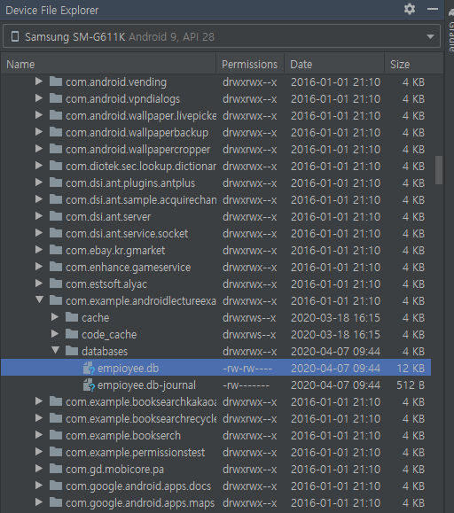
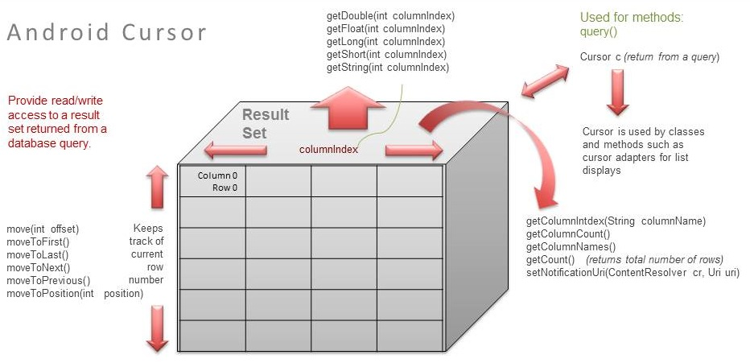

# Android DB

* 각 App 별로 별도의 Table 을 가지고 있음.
* Embedded형태로 개발된 DBMS가 내장
  * SQLite	

## SQLite

* 하나의 File로 만들어진다

  *  Database의 복사 , 이동같은 처리가 쉽다.
  * 속도가 빠르다.
  * 표준 SQL을 지원한다.

* Android DB 확인 하기 위한 [Tool](https://sqlitebrowser.org/) 이 필요

  

### DB 생성

* openOrCreateDatabase( )
  * public static SQLiteDatabase openOrCreateDatabase(File file, SQliteDatabase, CursorFactory factory)

```java
String dbName = etDBName.getText().toString();
//(Name, 읽기/쓰기(MODE_PRIVATE 는 상수로 0이다),
sqLiteDatabase = openOrCreateDatabase(dbName, MODE_PRIVATE, null);
```

* DB경로 확인

  * Device File Explower

    * 경로 - /data/data/App/database

    

### Table 생성

* sql 문 작성
* sqLiteDatabase.execSQL() 이용하여 sql적용

```java
//Table 생성
String tableName = etTableName.getText().toString();
if(sqLiteDatabase == null){
    Log.v(TAG,"DB생성 해주세요");
    return;
}else {
    //DB에 대한 reference가 존재
    //SQL을 이용해서 Database안에 Table 생성
    String sql = "CREATE TABLE IF NOT EXISTS " + tableName + "(_id INTEGER PRIMARY KEY AUTOINCREMENT, name TEXT, age INTEGER, mobile TEXT)";
    //SQL을 어떤 database에서 실행할지 결정
    sqLiteDatabase.execSQL(sql);
    Log.v(TAG,"Table생성");
}
```

### 행 추가

* 각 컬럼에 데이터 추가

```java
String name = etEmpName.getText().toString();
int age = Integer.parseInt(etEmpAge.getText().toString());
String phone = etEmpPhone.getText().toString();
if(sqLiteDatabase == null){
    Log.v(TAG,"DB 생성 해주세요");
    return;
}else {
    String sql ="INSERT INTO emp(name,age,mobile) VALUES" + "('"+name+"',"+age+",'"+phone+"')";
    sqLiteDatabase.execSQL(sql);
    Log.v(TAG,"Data Insert");
}
```

### SELECT 처리

* Select 문을 사용할떄는 sqLiteDatabase.rawQuery() 함수를 이용한다

* Cursor

  * This interface provides random read-write access to the result set returned by a database query

  

```java
String sql = "SELECT _id, name, age, mobile FROM emp";
if(sqLiteDatabase==null){
    Log.v(TAG,"DB 생성 해주세요");
    return;
}else {
    //execSQL() = select 계열이 아닌 SQL문장을 실행할떄 사용.
    //cursor 는 최초 컬럼을 가리키고 있다. 컬럼 에 포함된 데이터를 출력하기 위해서는 cursor 를 내려야하고(다음 데이터가 있으면 true 없으면 false 값을 반환)
    Cursor cursor = sqLiteDatabase.rawQuery(sql,null);
    Log.v(TAG,"empTable ="+cursor.toString());

    while (cursor.moveToNext()){
        //cursor 의 index 값이 Column을 가리킨다
        int id = cursor.getInt(0); // cursor 위치 의 컬럼
        String name1 = cursor.getString(1); //두번째 컬럼
        int age1 = cursor.getInt(2);
        String mobile = cursor.getString(3);

        String result = "레코드 : " + id + "," + name1 + "." + age1 + "," + mobile;

        tvEmpInfo.append(result+"\n");
    }
```


