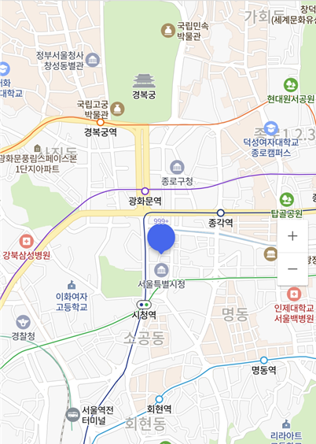

# NAVER_MAP

* 의존성

  * Gradle - 루트 프로젝트

  ```groovy
  allprojects {
      repositories {
          google()
          jcenter()
  
          // 네이버 지도 저장소
          maven {
              url 'https://navercorp.bintray.com/maps'
          }
      }
  }
  ```

  * Gradle - 앱 모듈

  ```groovy
  dependencies {
      // 네이버 지도 SDK
     	implementation 'com.naver.maps:map-sdk:3.8.0'
  }
  ```

* AndroidManifest.xml

  * name - com.naver.maps.map.CLIENT_ID
  * value - 발븝받은 클라이언트 ID를 지정

  ```xml
  <manifest>
      <application>
          <meta-data
              android:name="com.naver.maps.map.CLIENT_ID"
              android:value="YOUR_CLIENT_ID_HERE" />
      </application>
  </manifest>
  ```


* Image

 

* Basic Code

  * main.xml

  ```xml
  <?xml version="1.0" encoding="utf-8"?>
  <LinearLayout xmlns:android="http://schemas.android.com/apk/res/android"
    android:layout_width="match_parent"
    android:layout_height="match_parent"
    android:orientation="vertical">
    <RelativeLayout
      android:layout_width="match_parent"
      android:layout_height="match_parent">
      <com.naver.maps.map.MapView
        android:id="@+id/map_view"
        android:layout_width="match_parent"
        android:layout_height="match_parent"
        android:layout_below="@id/search_layout" />
      <androidx.recyclerview.widget.RecyclerView
        android:id="@+id/search_text_recycler_view"
        android:layout_width="match_parent"
        android:layout_height="wrap_content"
        android:layout_below="@id/search_layout" />
    </RelativeLayout>
  </LinearLayout>
  ```

  * MainActivity

  ```java
  public class MainActivity extends AppCompatActivity {
      
      @BindView(R.id.map_view)
    	MapView mMapView;
      
      @Override
      protected void onCreate(Bundle savedInstanceState) {
          super.onCreate(savedInstanceState);
          setContentView(R.layout.activity_main);
  
          mMapView.getMapAsync(this);
  
  	}
      @Override
    	public void onMapReady(@NonNull NaverMap naverMap) {
      // 네이버 지도 Ready
          setMarker(naverMap,37.478088,126.881517);
    	}
      
      private void setMarker(
          @NonNull NaverMap naverMap, 
          Double latitude, 
          Double longitude){
          
      	Marker marker = new Marker();
      	InfoWindow infoWindow = new InfoWindow();
          marker.setPosition(new LatLng(latitude, longitude));
          //원금감 표시
          marker.setIconPerspectiveEnabled(true);
         
          marker.setCaptionColor(R.color.color_ffffff);
          marker.setCaptionTextSize(9);
          marker.setMap(naverMap);
  		//Marker Touch Event
          marker.setOnClickListener(new Overlay.OnClickListener() {
            	@Override
            	public boolean onClick(@NonNull Overlay overlay) {
              	Timber.i("MARKER");
                  //InfoWindow 호출
                  infoWindow.setAdapter(
                      new InfoWindow.DefaultTextAdapter(
                          getActivity().getApplication()) {
              		@NonNull
              		@Override
              		public CharSequence getText(@NonNull InfoWindow infoWindow) {
                			return "InfoWindow";
              		}
            		});
            		infoWindow.open(marker);
              	return false;
            	}
          });
    	}
      
       /**
   * Naver Map Polygon Overlay
     *
     * @param naverMap
     */
    private void setPolygonOverlay(@NonNull NaverMap naverMap) {
      //Naver Map Polygon Overlay
      PolygonOverlay polygonOverlay = new PolygonOverlay();
  
      List<LatLng> latLngs = new ArrayList<>();
  
      for (int i = 0; i < areaPointList.size(); i++) {
        latLngs.add(new LatLng(Double.parseDouble(areaPointList.get(i).getLat()), Double.parseDouble(areaPointList.get(i).getLng())));
      }
  
      polygonOverlay.setCoords(latLngs);
      polygonOverlay.setColor(Color.parseColor("#26F95959"));
      polygonOverlay.setOutlineColor(Color.RED);
      polygonOverlay.setOutlineWidth(5);
      polygonOverlay.setMap(naverMap);
  
      polygonList.add(polygonOverlay);
  
      if (polygonList.size() > 1) {
        Timber.i("remove polygonOverlay");
        polygonList.get(0).setMap(null);
        polygonList.remove(0);
      }
  
      //polygon Click Event
      polygonOverlay.setOnClickListener(new PolygonOverlay.OnClickListener() {
        @Override
        public boolean onClick(@NonNull Overlay overlay) {
          Timber.i("PolygonOverlay");
          return false;
        }
      });
    }
  }
  ```
  
  


## Reference

[https://navermaps.github.io/android-map-sdk/guide-ko/1.html](https://navermaps.github.io/android-map-sdk/guide-ko/1.html)

