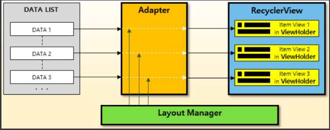
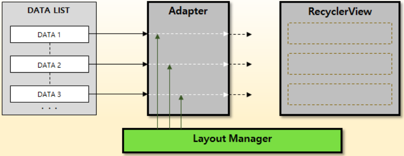
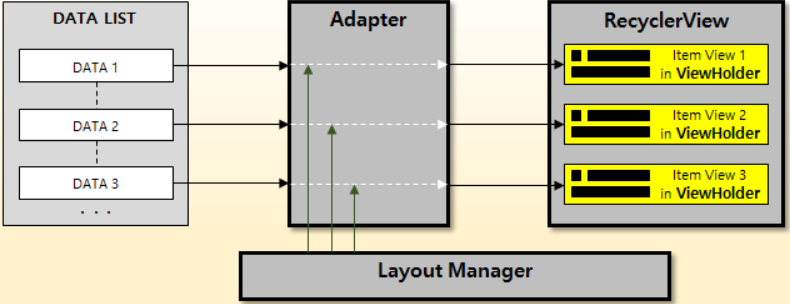
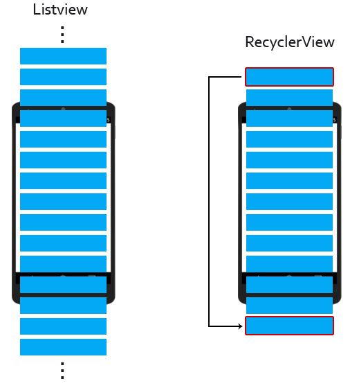
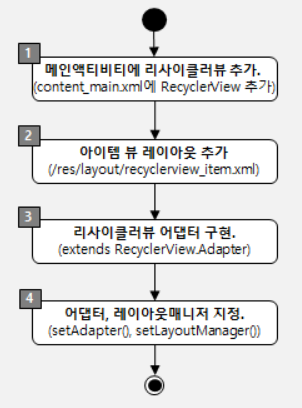

# RecyclerVIew

* App에서 대량의 데이터 세트 또는 자주 변경되는 데이터에 기반한 요소의 스크롤 목록을 표시해야할떄 사용.
* LIstVIew 보다 진보하고 유연해진 버전 

## RecyclerView 를 위한 구성 요소

* Layout Manager\
  * ItemView가 나열되는 형태를 관리
  * Vertical, Horizontal, Grid 형태의 레이아웃을 나타낼수 있음.
  * Adapter를 통해 만들어진 각 아이템 뷰는 ViewHolder객체에 저장되어 화면에 표시되고, 필요에 따라 생송 또는 재활용 된다.



### RecyclerView

* v7지원 라이브러리에서 제공되는 위젯으로 사용자 데이터를 리스트 형태로 화면에 표시하는 컨테이너 역할 수행


### Adpater

* RecyclerView 에 표시될 아이템 뷰를ㄹ 생성하는 역할을 담당,
* 사용자 데이터 리스트로부터 아이템뷰를 만드는 것

```java
android.support.v7.widget.RecyclerView.Adapter
```


### LayoutManager

* RecyclerView가 아이템을 화면에 표시할 때, 아이템 뷰들이 RecyclerView내부에서 배치되는 형태를 관리



* **LinearLayoutManager** : 수평(Horizontal) 또는 수직(Vertical) 방향, 일렬(Linear)로 아이템 뷰 배치.
* **GridLayoutManager** : 바둑판 모양의 격자(Grid) 형태로 아이템 뷰 배치.
* **StaggeredGridLayoutManager** : 엇갈림(Staggered) 격자(Grid) 형태로 아이템 뷰 배치.


+ LayoutManager는 더 이상 화면에 표시되지 않는 아이템 뷰를 언제 재활용 할 것인지에 대한 정책도 결정

### ViewHolder

* 화면에 표시될 아이템 뷰를 저장하는 객체
* Adapter에 의해 관리되며, 필요에따라 Adapter에서 생송된다(LayoutManager의 아이템뷰 재활용 정책에따라)
* 미리 생성된 뷰홀더 객체가 있는경우에는 새로 생성하지 않고 이미 만들어져 있는 뷰홀더를 재활용 한다(=데이터가 뷰홀더의 아이템 뷰에 Binding)



## RecyclerView의 재활용성

 

* ListVIew
  * 아래로 스크롤 할때 마다 맨 위에 위차한 뷰 객체가 삭제되고, 아랫 부분에서 나타날 뷰 객체를 새로 생성하면서 100개의 뷰 객체가 삭제되고 생성된다.
* RecyclerView
  * 사용자가 아래로 스크롤 할때 맨 위에 위치한 뷰 객체가 아래쪽에 새로 나올 뷰 객체로 이동하여 삭제와 생성을 하지않고 재사용 한다.
  * 맨 처음 화면에 보여질 10개 정도의 뷰 객체만을 만들고, 실제 데이터가 100개든 1000개든 원래 만들어 놓은 10개의 객체만 계속 해서 재사용 한다.

## 기본 사용

* Workflow

 .


* Method 실행 순서
  1. getItemCount()
     * 화면에 표시해줄 데이터의 전체 길이를 리턴
  2. getItemViewType()
  3. onCreateViewHolder()
     * ItemClass
     * VIewHolder 생성
  4. onBindViewHolder
     * 생성된 VIewHolder에 데이터를 바인딩 해주는 함수
     * 데이터가 스크롤 되어서 맨위에있던 뷰 홀더 객체가 아래로 이동하면, 그레아웃은 재사용 하되 데이터는 새롭게 바뀐다
       * 새롭게 보여질 데이터의 인덱스 값을 position 파라미터로 받을 수 있다.

 

### Reference

[Developers java source](https://github.com/android/views-widgets-samples/tree/master/RecyclerView)

[참고 자료](https://dev-imaec.tistory.com/27)


## SnapHelper

### Reference

[AndroidDeveloper](https://developer.android.com/reference/android/support/v7/widget/SnapHelper)


## 특정 View ClickEvent

* RecyclerVIew 안의 Button이나 TextView,Layout같은 특정 View를 터치 혹은 킬릭하는 것을 감지하기 위해 RecyclerViewAdapter 안에 OnItemClickListener interface와 그 멤버변수를 선언

### Reference

[ClickEvent](http://superstress.com/4/12/14/)

[11](https://onlyformylittlefox.tistory.com/9)


## Err

* err code

```
Error inflating class android.support.v7.widget.RecyclerView
```

[확인 사이트](https://stackoverflow.com/questions/25477860/error-inflating-class-android-support-v7-widget-recyclerview)


## Expandable RecyclerView

* RecyclerView Item클릭시 UI에 변화 줄떄 사용
* ItemVIewHolder는 View의 재활용을 담당하기 때문에 **UI에 변화를 주고 스크롤을 하면 다른 position의 Item에도 변화가 갈수 있다.**
  * **SparseBooleanArray**를 이용하여 Item의 클릭 상태를 저장하여 문제 해결 가능하다

### Reference

[Expandable ](https://dev-imaec.tistory.com/30)

[ Expandable RecyclerView](https://lakue.tistory.com/15?category=853542)


## Intent&Bundle

### Intent

* 어플리케이션 구성요소 간에 작업 수행을 위한 정보를 전달하는 역할

### Bundle

* 문자열로된 키와 여러가지의 타입의 값을 저장하는 일죵의 Map클래스(상태/값 등을 저장)
* Activity 간에 데이터를 주고 받을때 Bundle 클래스를 사용하여 여러가지의 데이터를 전송
* 전달 type종류
  * int
  * dobule
  * long
  * String
  * FloatArray
  * StringArrayList
  * Serializable
  * Parcelable

```
일반적으로 intent 시 putExtra로  primitive data type을 넘기는 건 많이 보셨을 겁니다. 하지만 클래스 등의 reference type의 경우(c에서 구조체를 연상하시면 더 쉽습니다) 에는 putExtra로 따로 오버로딩 되 있는 method를 찾을 수 없습니다.

그 대안으로 사용 할 수 있는게 putParcelableArrayListExtra 입니다.  여기에는 key와 value의 쌍(이중 해쉬형태로..)으로 data array를 전달하게 됩니다.

parcelable 은 인터페이스로서 bundle 에서도 구현하고 있습니다. 파일 입출력이나 네트워크시 사용되는 직렬화와 유사하게 인텐트(ipc를 생각해 보세요.)시에는 이 parcelable 을 구현한 데이터를 putExtra(Bundle bundle)이나 위의 method로 전달할 수 있어 개발자에게 매우 큰 장점이 되겠죠...
```

### Fragment 사용 할떄 

```java
// 줄때
Fragment f = new Fragment();
Bundle bundle = new Bundle();
bundle.putSerializable("Obj", item);   // Object 넘기기
bundle.putParcelableArrayList("list", (ArrayList<? extends Parcelable>) list); // list 넘기기
f.setArguments(bundle);
 
// 받을때
Bundle bundle = getArguments();
bundle.getSerializable("Obj");
bundle.getParcelableArrayList("list");
```

```java
FragmentManager fragmentManager = getActivity().getSupportFragmentManager();
fragmentManager.beginTransaction().remove(CalendarFragment.this).commit();
fragmentManager.popBackStack();

프레그먼트 종료
```


## Other Refernece

[itemListener](https://onlyformylittlefox.tistory.com/9)

[RecyclerView 이해](https://wooooooak.github.io/android/2019/03/28/recycler_view/)