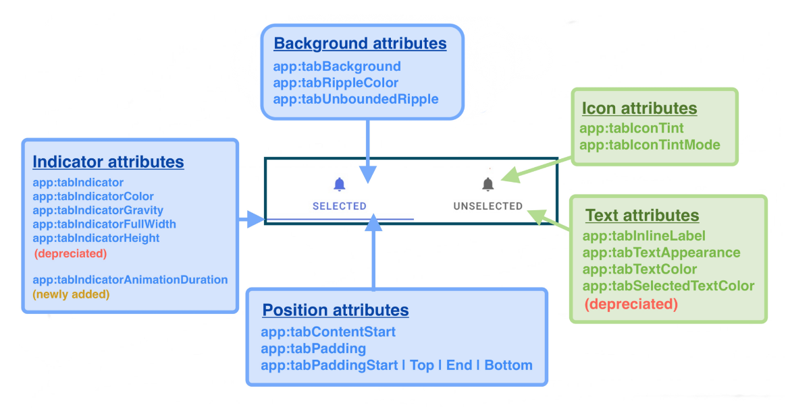

# TabLayout

* 종속성

```
dependencies {
	mplementation 'com.android.support:design:29.1.0'
```

## Touch Event

```java
tabLayout.addOnTabSelectedListener(new TabLayout.OnTabSelectedListener(){
    @Override
    public void onTabSelected(TabLayout.Tab tab) {
        //Tap 이 선택 되었을떄 호출
        switch (tab.getPosition()){
            case  0:
                
                break;
            case 1:
                
                break;
        }
    }
    @Override
    public void onTabUnselected(TabLayout.Tab tab) {
        //Tap 이 선택되지 않았을때 호출
        Log.v(TAG,"onTabUnselected()=="+tab);
    }
    @Override
    public void onTabReselected(TabLayout.Tab tab) {
        //Tap 이 다시 선택 되었을떄 호출
        Log.v(TAG,"onTabReselected()=="+tab);
    }
});
```

## Err 

```
 android.view.InflateException:
```

* 기존 Layout <android.support.design.widget.TabLayout

  ```xml
  <android.support.design.widget.TabLayout
          android:id="@+id/tabLayout"
          android:layout_width="match_parent"
          android:layout_height="wrap_content"
  ```

* 수정후 Layout <com.google.android.material.tabs.TabLayout

  ```xml
  <com.google.android.material.tabs.TabLayout
          android:id="@+id/tabLayout"
          android:layout_width="match_parent"
          android:layout_height="wrap_content"
  ```

  * [참고](https://hee96-story.tistory.com/52)



## 참고 자료

[TabLayout Basic](https://alliwannado-start.tistory.com/4)