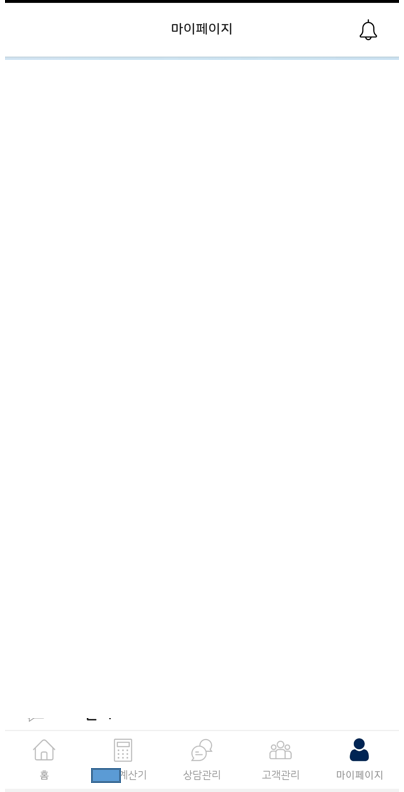

# TabLayout&viewPager


## 레이아웃 구성

* XML

```xml
<RelativeLayout xmlns:android="http://schemas.android.com/apk/res/android"
  android:layout_width="match_parent"
  android:layout_height="match_parent"
  xmlns:app="http://schemas.android.com/apk/res-auto"
  android:orientation="vertical">
  <rocateer.finaltor.utils.SwipeViewPager
    android:id="@+id/main_view_pager"
    android:layout_width="match_parent"
    android:layout_height="match_parent"
    android:layout_above="@+id/main_tab_layout"/>

  <LinearLayout
    android:layout_width="match_parent"
    android:layout_height="1dp"
    android:layout_above="@id/main_tab_layout"
    android:background="@color/color_eeeeee" />

  <com.google.android.material.tabs.TabLayout
    android:id="@+id/main_tab_layout"
    android:layout_width="match_parent"
    android:layout_height="60dp"
    android:layout_alignParentBottom="true"
    android:layout_gravity="center"
    android:background="@color/color_ffffff"
    app:tabGravity="fill"
    app:tabIconTint="@color/color_00000000"
    app:tabIconTintMode="src_atop"
    app:tabIndicatorHeight="0dp"
    app:tabMode="fixed"
    app:tabTextAppearance="@style/TabLayoutStyle"
    app:tabTextColor="@color/color_999999">
    <com.google.android.material.tabs.TabItem
      android:layout_width="wrap_content"
      android:layout_height="wrap_content"
      android:icon="@drawable/menu_1_off"
      android:text="홈" />
    <com.google.android.material.tabs.TabItem
      android:layout_width="wrap_content"
      android:layout_height="wrap_content"
      android:icon="@drawable/loan_menu_2_off"
      android:text="대출계산기"/>
    <com.google.android.material.tabs.TabItem
      android:layout_width="wrap_content"
      android:layout_height="wrap_content"
      android:icon="@drawable/loan_menu_3_off"
      android:text="상담관리"/>
    <com.google.android.material.tabs.TabItem
      android:layout_width="wrap_content"
      android:layout_height="wrap_content"
      android:icon="@drawable/loan_menu_4_off"
      android:text="고객관리"/>
    <com.google.android.material.tabs.TabItem
      android:layout_width="wrap_content"
      android:layout_height="wrap_content"
      android:icon="@drawable/loan_menu_5_off"
      android:text="마이페이지"/>
  </com.google.android.material.tabs.TabLayout>


</RelativeLayout>
```


## 텝레이아웃 이벤트 처리

* Activity

```java
mMainTabLayout.getTabAt(0).setIcon(R.drawable.loan_menu_1_on);
mMainTabLayout.getTabAt(1).setIcon(R.drawable.loan_menu_2_off);
mMainTabLayout.getTabAt(2).setIcon(R.drawable.loan_menu_3_off);
mMainTabLayout.getTabAt(3).setIcon(R.drawable.loan_menu_4_off);
mMainTabLayout.getTabAt(4).setIcon(R.drawable.loan_menu_5_off);

LoanMainTabPagerAdapter mLoanMainTabPagerAdapter =
    new LoanMainTabPagerAdapter(getSupportFragmentManager(), this);
mMainViewPager.setAdapter(mLoanMainTabPagerAdapter);
mMainViewPager.setOffscreenPageLimit(5);
mMainViewPager.addOnPageChangeListener(new TabLayout.TabLayoutOnPageChangeListener(mMainTabLayout));
mMainViewPager.setPagingEnabled(false);

mMainTabLayout.setOnTabSelectedListener(new TabLayout.OnTabSelectedListener() {
    @Override
    public void onTabSelected(TabLayout.Tab tab) {
        if (tab.getPosition() == 0){
            tab.setIcon(R.drawable.loan_menu_1_on);
        }else if (tab.getPosition() == 1){
            tab.setIcon(R.drawable.loan_menu_2_on);
        }else if (tab.getPosition() == 2){
            tab.setIcon(R.drawable.loan_menu_3_on);
        }else if (tab.getPosition() == 3){
            tab.setIcon(R.drawable.loan_menu_4_on);
        }else if (tab.getPosition() == 4){
            tab.setIcon(R.drawable.loan_menu_5_on);
        }
        mMainViewPager.setCurrentItem(tab.getPosition());

    }
    @Override
    public void onTabUnselected(TabLayout.Tab tab) {
        if (tab.getPosition() == 0){
            tab.setIcon(R.drawable.loan_menu_1_off);
        }else if (tab.getPosition() == 1){
            tab.setIcon(R.drawable.loan_menu_2_off);
        }else if (tab.getPosition() == 2){
            tab.setIcon(R.drawable.loan_menu_3_off);
        }else if (tab.getPosition() == 3){
            tab.setIcon(R.drawable.loan_menu_4_off);
        }else if (tab.getPosition() == 4){
            tab.setIcon(R.drawable.loan_menu_5_off);
        }
    }

    @Override
    public void onTabReselected(TabLayout.Tab tab) {

    }
});

mMainTabLayout.getTabAt(0).select();
mMainViewPager.setCurrentItem(0);
```

* TabPagerAdapter
  * getItem() 메셔드에서 포지션 값을 인자로 받아 해당 포지션(tab)별 Fragment 호출

```java
public class LoanMainTabPagerAdapter extends FragmentStatePagerAdapter {

  private LoanMainActivity mLoanMainActivity;

  private LoanHomeFragment mLoanHomeFragment;
  private ConsultationManagementFragment mConsultationManagementFragment;
  private CustomerManagementFragment mCustomerManagementFragment;
  private ExpertMyPageFragment mExpertMyPageFragment;

  public LoanMainTabPagerAdapter(FragmentManager fragmentManager,LoanMainActivity mLoanMainActivity){
    super(fragmentManager);
    this.mLoanMainActivity = mLoanMainActivity;
  }

  @Override
  public Fragment getItem(int position) {
    switch (position){
      case 0:
        mLoanHomeFragment = new LoanHomeFragment(mLoanMainActivity);
        return mLoanHomeFragment;
      case 1:
        mLoanHomeFragment = new LoanHomeFragment(mLoanMainActivity);
        return mLoanHomeFragment;
      case 2:
        mConsultationManagementFragment = new ConsultationManagementFragment();
        return mConsultationManagementFragment;
      case 3:
        mCustomerManagementFragment = new CustomerManagementFragment();
        return mCustomerManagementFragment;
      case 4:
        mExpertMyPageFragment = new ExpertMyPageFragment();
        return mExpertMyPageFragment;
    }
    return null;
  }

  @Override
  public int getCount() {
    return 5;
  }
}

```

## 실행 화면

 