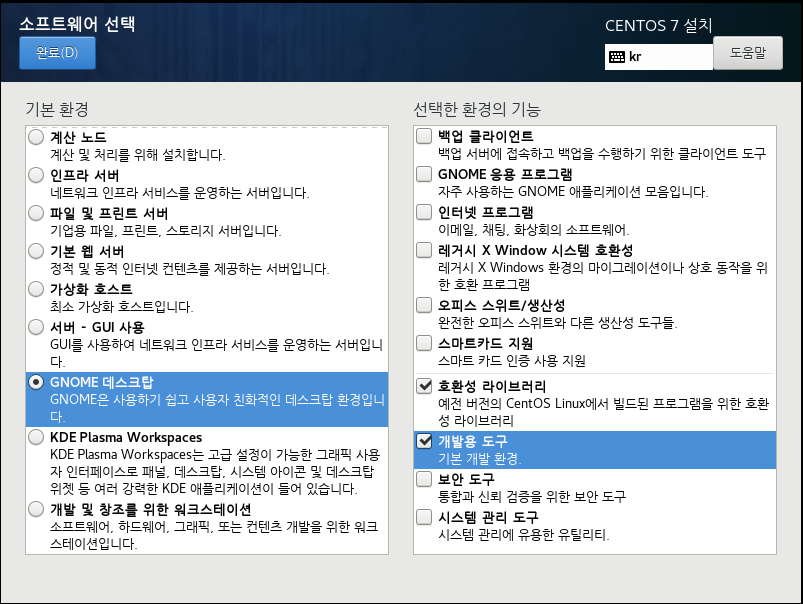
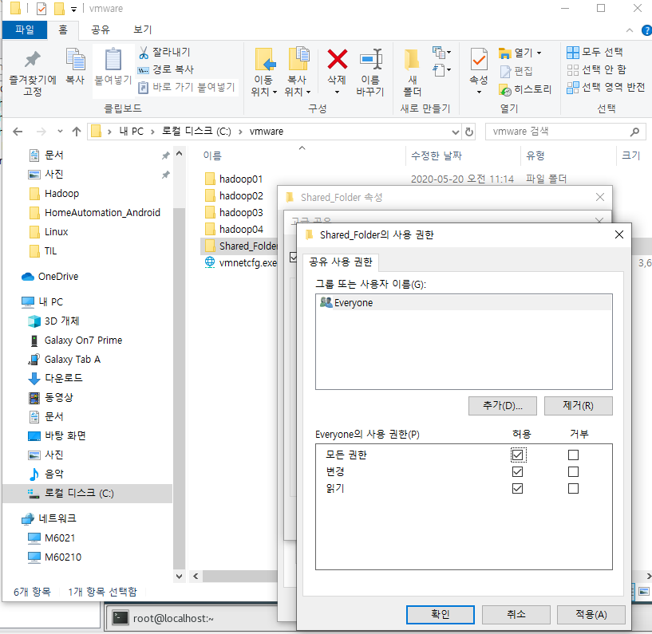

# Hadoop

* 선형확장을 지원
  * 데이터 사용의증가를 보면서 추후에 용량증가가 용이하다.
* 분석치리에 사용
  * Map/Reduce를 이용해서 대용량의 데이터 분석 가능
* API기반의 파일처리 System
* Immutable file system
  * ex) Log Data
  * 파일이 한번 저장되면 변경이 되지 않는것을 가정한다.
    * 하둡버전이 올라가면서 API를 통해 Append, Delete기능이 추가 되었다.
* Master Slave 구조를 가진다
  * Master - slave에 저장된 데이터 경로를 알려준다
    * Master가 고장나면 전체 파일시스템을 사용할 수 없다. =  SPOF(Single Point of Failure)
    * Secondary Master를 병행하여 문제 해결
  * Slave - 데이터 저장 용도

## Setting

[Dowon](https://www.vmware.com/kr/products/workstation-pro/workstation-pro-evaluation.html)


* VMwarePro 실행 
  * Create


* 메모리 추가


* [CenoOS DOWNLOAD](http://mirror.kakao.com/centos/7.8.2003/isos/x86_64/)


## CentOS Setting

* Setting - CentOS IOS 경로 입력 - Powor Start - install - 언어 - 한국어 선택 
* 네스워크 -  켬


* 소프트웨어 - GNOME 데스크탑 선택 - 호환성 라이브러리  & 개발용도구 선택



* 설치대상 -  파티션 설정 체크 - 표준파티션 선택  - +눌러 생성 - 변경사항 적용


* swap


* /boot
  * 부팅 필요한


* /home
  * 저장될 데이터
* /
  * Linux시스템 저장 공간


* 설치시작 - 암호설정(q1w2e3) - 사용자 생성 (ID-hadooptest PW-q1w2e3)


## Clone

* My Computer - 우Click - Manage - clone -Create full clone - name 설정/ 경로 설정


## 구조


### Hadoop System 구조

* Master(Name node) - Secondary Name node
  * Slave(data node)
    * Disk
  * Slave(data node)
    * Disk
  * Slave(data node)
    * Disk

### [HDFS](https://yookeun.github.io/java/2015/05/24/hadoop-hdfs/)


## Start???????

> Hadoop 2.9.2 Version
>
> Java 8 ver 설치 (각각의 서버마다 설치가 되어야한다)

* Hadoop01 - Name Node (host name = namenode)
* Hadoop02 - Data Node (host name = datanode01)
* Hadoop03 - Data Node (host name = datanode02)
* Hadoop04 - Data Node  (host name = datanode03)

### Mode

1. Standalone
   * 단일 노드
2. pseudo distributed 
   * 단일 node에서 cluster
3. Full distributed
   * 2대 이상의 Node를 Cluster로 구성

### 명령어

바탕화면

* rpm -qa | grep java
  * 자바 version 확인
* yum remove xxxxxxx
  * 3가지 remove
  * yum remove javapackages-tools-3.4.1-11.el7.noarch
  * yum remove python-javapackages-3.4.1-11.el7.noarch
  * yum remove tzdata-java-2018e-3.el7.noarch

 

### 공유폴더 설정

* Window 에서 설정
  * 공유 폴더 생성
  * 공유폴더 속성 -공유 - 고급공유 - 선택한 폴더공유 Check - 권한 - 모든권한 허용 check

 

* VMware 에서 설정

  * hadoop01 - setting - options tab - shared Folder - Always enable - add - 폴더 설정
  * 설정하고 Linux에 /mnt 경로에 표시됨

   


### java install

* JDK 파일 경로 이동

```
mv jdk1.8.0_251 /usr/local/java
```

* vi /etc/profile
  * vi 편집기 에서 아래쪽에 4줄 삽입
    * i - 수정
    * esc -> :wq - 종료

```
export JAVA_HOME=/usr/local/java
export HADOOP_HOME=/usr/local/hadoop
export CLASSPATH=$JAVA_HOME/lib:$CLASSPATH
PATH=$PATH:$JAVA_HOME/bin:$HADOOP_HOME/bin:$HADOOP_HOME/sbin
```

* source /etc/profile

```

```

* 버젼확인
  * java -version

```
java -version
java version "1.8.0_251"
```


## Reference

[HDFS Basic](https://yookeun.github.io/java/2015/05/24/hadoop-hdfs/)

