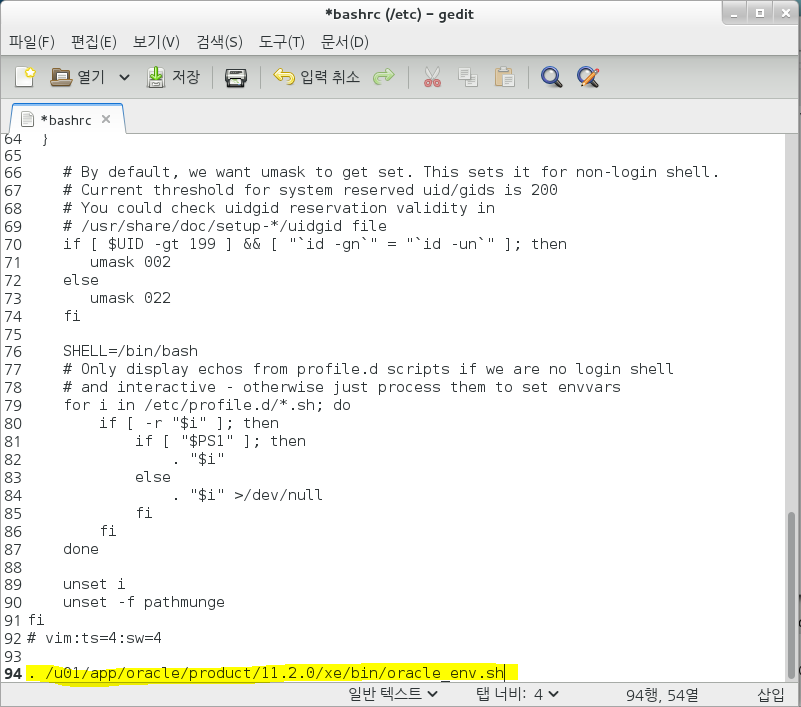
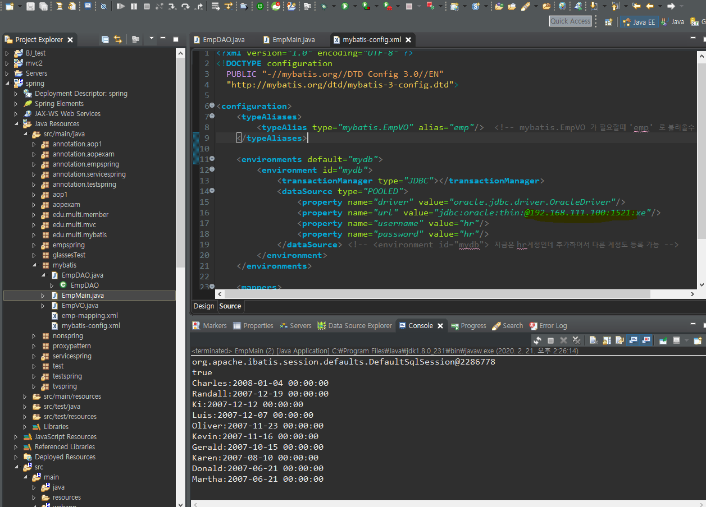

# Oracle DB설치

[Oracle](https://www.oracle.com/database/technologies/xe-prior-releases.html)


* 압축풀기

```
[root@localhost ~]# unzip 다운로드/oracle*
Archive:  다운로드/oracle-xe-11.2.0-1.0.x86_64.rpm.zip
   creating: Disk1/
   creating: Disk1/upgrade/
  inflating: Disk1/upgrade/gen_inst.sql  
   creating: Disk1/response/
  inflating: Disk1/response/xe.rsp   
  inflating: Disk1/oracle-xe-11.2.0-1.0.x86_64.rpm 
  
[root@localhost ~]# ls
Disk1            hardlink              sample.txt   공개      바탕화면  서식
all.cfg          initial-setup-ks.cfg  sample.txt~  다운로드  비디오    음악
anaconda-ks.cfg  result.txt            softlink     문서      사진

[root@localhost ~]# cd Disk1
```

정보확인

```
[root@localhost Disk1]# rpm -qip oracle-xe-11.2.0-1.0.x86_64.rpm
Name        : oracle-xe
Version     : 11.2.0
Release     : 1.0
Architecture: x86_64
Install Date: (not installed)
Group       : Applications/OracleXE
Size        : 591492962
License     : Oracle Corporation
Signature   : (none)
Source RPM  : oracle-xe-11.2.0-1.0.src.rpm
Build Date  : 
Build Host  : dadvfg0711.us.oracle.com
Relocations : (not relocatable)
Packager    : Oracle <www.oracle.com>
URL         : http://www.oracle.com
Summary     : Oracle Database 11g Release 2 Express Edition
Description :
Oracle Database 11g Release 2 Express Edition

```

rpm 설치

> yum localinstall orcle......
>
> Oracle 설치시 2G가 부족해서 임시적으로 늘려줘야함

* swap - 임시메모리(2GB로 초기 설정 했음.)

## 임시 메모리 확장

* 임시 메모리 늘리기 p.573 참조
* dd if=/dev/zero of=/swapfile bs=1024 count=4194304 
  * 가상 메모리용 파일 생성(4GB)
* mkswap /swapfile
  * 파일용 가상 메모리로 포멧
* swapon /swapfile
  * 가상 메모리 활성화

```
[root@localhost /]# free -m
             total       used       free     shared    buffers     cached
Mem:          1987       1912         75         23          0        366
-/+ buffers/cache:       1545        442
Swap:         1999        176       1823

[root@localhost /]# swapon -s
Filename				Type		Size	Used	Priority
/dev/sda1                              	partition	2047996	180308	-1

[root@localhost /]# dd if=/dev/zero of=/swapfile bs=1024 count=4194304
4194304+0 records in
4194304+0 records out
4294967296 bytes (4.3 GB) copied, 8.1924 s, 524 MB/s

[root@localhost /]# mkswap /swapfile
Setting up swapspace version 1, size = 4194300 KiB
no label, UUID=d434a365-7977-4c49-89cd-c8cee052568e

[root@localhost /]# swapon /swapfile
swapon: /swapfile: insecure permissions 0644, 0600 suggested.

[root@localhost /]# swapon -s
Filename				Type		Size	Used	Priority
/dev/sda1                              	partition	2047996	445188	-1
/swapfile                              	file	4194300	0	-2
```

* Oracle install 

  * yum -y localinstall ora...    

    > 중간에 

```
[root@localhost /]# cd /root/Disk1/
[root@localhost Disk1]# ls -l
합계 309884
-rw-rw-r-- 1 root root 317320273  8월 29  2011 oracle-xe-11.2.0-1.0.x86_64.rpm
drwxr-xr-x 2 root root        19  8월 29  2011 response
drwxrwxr-x 2 root root        25  8월 29  2011 upgrade
[root@localhost Disk1]# yum -y localinstall oracle-xe-11.2.0-1.0.x86_64.rpm
Loaded plugins: fastestmirror, langpacks
Examining oracle-xe-11.2.0-1.0.x86_64.rpm: oracle-xe-11.2.0-1.0.x86_64
Marking oracle-xe-11.2.0-1.0.x86_64.rpm to be installed
Resolving Dependencies
--> Running transaction check
---> Package oracle-xe.x86_64 0:11.2.0-1.0 will be installed
--> Finished Dependency Resolution

Dependencies Resolved

================================================================================
 Package       Arch       Version        Repository                        Size
================================================================================
Installing:
 oracle-xe     x86_64     11.2.0-1.0     /oracle-xe-11.2.0-1.0.x86_64     564 M

Transaction Summary
================================================================================
Install  1 Package

Total size: 564 M
Installed size: 564 M
Downloading packages:
Running transaction check
Running transaction test
Transaction test succeeded
Running transaction
  Installing : oracle-xe-11.2.0-1.0.x86_64                                  1/1 
Executing post-install steps...
You must run '/etc/init.d/oracle-xe configure' as the root user to configure the database.

  Verifying  : oracle-xe-11.2.0-1.0.x86_64                                  1/1 

Installed:
  oracle-xe.x86_64 0:11.2.0-1.0                                                 

Complete!
```

* 설치 확인
  * rpm -qa

```
[root@localhost Disk1]# rpm -qa | grep oracle
oracle-xe-11.2.0-1.0.x86_64
```

# Oracle DB Setting

```
[root@localhost Disk1]# service oracle-xe configure

Oracle Database 11g Express Edition Configuration
-------------------------------------------------
This will configure on-boot properties of Oracle Database 11g Express 
Edition.  The following questions will determine whether the database should 
be starting upon system boot, the ports it will use, and the passwords that 
will be used for database accounts.  Press <Enter> to accept the defaults. 
Ctrl-C will abort.

Specify the HTTP port that will be used for Oracle Application Express [8080]: ==> server port Num

Specify a port that will be used for the database listener [1521]:  ==>oracle DB port Num

Specify a password to be used for database accounts.  Note that the same
password will be used for SYS and SYSTEM.  Oracle recommends the use of 
different passwords for each database account.  This can be done after 
initial configuration:
Confirm the password:

Do you want Oracle Database 11g Express Edition to be started on boot (y/n) [y]:

Starting Oracle Net Listener...Done
Configuring database...Done
Starting Oracle Database 11g Express Edition instance...Done
Installation completed successfully.
```

* Oracle DB 시작

```
[root@localhost Disk1]# /etc/init.d/oracle-xe start
Starting oracle-xe (via systemctl):                        [  OK  ]
```

```
[root@localhost Disk1]# /etc/init.d/oracle-xe start
Starting oracle-xe (via systemctl):                        [  OK  ]

[root@localhost Disk1]# find / -name oracle*
/root/Disk1/oracle-xe-11.2.0-1.0.x86_64.rpm

[root@localhost Disk1]# cd /u01/app/oracle/product/11.2.0/xe/
[root@localhost xe]# ls
apex    ctx   hs    ldap  md       odbc     plsql    slax
bin     dbs   jdbc  lib   network  opmn     precomp  sqlplus
config  demo  jlib  log   nls      oracore  rdbms    xdk
[root@localhost xe]# . /u01/app/oracle/product/11.2.0/xe/bin/oracle_env.sh ==>. / ==실행 표시

[root@localhost xe]# cat /u01/app/oracle//product/11.2.0/xe/bin/oracle_env.sh  
export ORACLE_HOME=/u01/app/oracle/product/11.2.0/xe
export ORACLE_SID=XE
export NLS_LANG=`$ORACLE_HOME/bin/nls_lang.sh`
export PATH=$ORACLE_HOME/bin:$PATH
```


```
[root@localhost xe]# gedit /etc/bashrc
```



```
위에 문구를 저장하면
[root@localhost xe]# . /u01/app/oracle/product/11.2.0/xe/bin/oracle_env.sh
를 안해도 된다
```


## 방화벽 해제

* 1521 = jdbc Port
* 8080 = Linux Servoer Port

```
[root@localhost xe]# firewall-config
```

 

* http://192.168.111.100:8080/apex/

   방화벽 해제 확인

```
[root@localhost xe]# sqlplus

SQL*Plus: Release 11.2.0.2.0 Production on 금 2월 21 13:57:35 2020

Copyright (c) 1982, 2011, Oracle.  All rights reserved.

Enter user-name: system
Enter password: 
ERROR:
ORA-01017: invalid username/password; logon denied


Enter user-name: system
Enter password: 

Connected to:
Oracle Database 11g Express Edition Release 11.2.0.2.0 - 64bit Production
```

```
Warning: You are no longer connected to ORACLE.
SQL> alter user hr identified by hr account unlock;
SP2-0640: Not connected
SQL> conn system/oracle
Connected.
SQL> alter user hr identified by hr account unlock;

User altered.

SQL> conn hr/hr
Connected.
```


## Mybatis - Linux DB 활용

* windows Oracle에서 Linux DB 접속 Test



local에서 Linux DB port 번호로 수정


해당 영역 바꿔주면 Linux DB 활용가능


## Linux 터미널에서 windows DB 계정 접속 설정

```
[root@localhost xe]# cd /u01
[root@localhost u01]# ls
app
[root@localhost u01]# cd app
[root@localhost app]# cd oracle
[root@localhost oracle]# cd product
[root@localhost product]# cd 11.2.0
[root@localhost 11.2.0]# cd xe
[root@localhost xe]# ls
apex    ctx   hs    ldap  md       odbc     plsql    slax
bin     dbs   jdbc  lib   network  opmn     precomp  sqlplus
config  demo  jlib  log   nls      oracore  rdbms    xdk
[root@localhost xe]# cd network
[root@localhost network]# cd admin
[root@localhost admin]# pwd
/u01/app/oracle/product/11.2.0/xe/network/admin
[root@localhost admin]# ls
listener.ora  samples  tnsnames.ora

[root@localhost admin]# gedit tnsnames.ora 
```


```
[root@localhost admin]# /etc/init.d//oracle-xe stop
Stopping oracle-xe (via systemctl):                        [  OK  ]
[root@localhost admin]# /etc/init.d//oracle-xe start
Starting oracle-xe (via systemctl):                        [  OK  ]

[root@localhost admin]# sqlplus

SQL*Plus: Release 11.2.0.2.0 Production on 금 2월 21 14:43:56 2020

Copyright (c) 1982, 2011, Oracle.  All rights reserved.

Enter user-name: hr
Enter password: 

Connected to:
Oracle Database 11g Express Edition Release 11.2.0.2.0 - 64bit Production

SQL> conn scott/TIGER@win  ==>windows Oracle 
Connected.

```

 Linux 터미널 에서 widows DB SCOTT 계정 불러온 화면


* Oracle DB 계정 접속 예제

```

conn SCOTT/TIGER == linux Oracle 접속
conn scott/TIGER@win  ==>windows Oracle 접속
```

