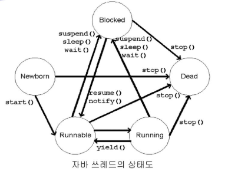
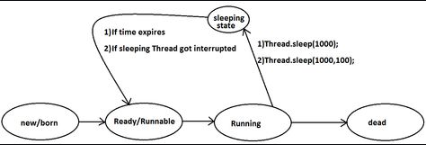
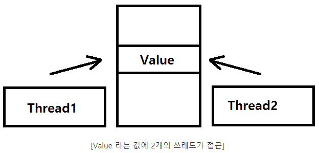

# Network Program

## Java Thread

> * 독립적 실행흐름
>   1. Thread class를 직접 상속해 사용
>      * 상속 개념을 사용해서 객체사용에 제한.
>   2. Runnable Interface구현한 객체를 이용해 Thread생성

### JavaFX

* FX library  Download(JAR File)

  * project File right Click - new - property - Java build path -  library - Add JARs (JAR File찾아 경로 선택) - Apply

     

* Application class 상속

  ```java
  import javafx.application.Application;
  ```

  * start() method Override

    ```java
    @Override
    	public void start(Stage arg0) throws Exception {
    	}
    ```

* BorderPane

  * 동,서,남,북,중앙 으로 구성

* Java FX 화면 및 Code

 

```java
package javaThread;

import javafx.application.Application;
import javafx.event.ActionEvent;
import javafx.event.Event;
import javafx.event.EventHandler;
import javafx.scene.Scene;
import javafx.scene.control.Button;
import javafx.scene.control.TextArea;
import javafx.scene.layout.BorderPane;
import javafx.scene.layout.FlowPane;
import javafx.stage.Stage;

// javaFX 를 이용한 화면 UI 생성
// JavaFX library 활용
// 1.Application이라는 class 상속해서 우리 class를 define한다
// 2.Application이 가지고있는 start() abstract method를 overriding.

public class Exam00_javaFxUiTemplate extends Application {

	TextArea textArea;
	Button button;

	public static void main(String[] args) {
		// 화면에 창을 띄운다
		launch(); // 실행되면 start()가 호출
	}

	@SuppressWarnings("unchecked")
	@Override
	public void start(Stage primaryStage) throws Exception {
		// 화면구성, 이벤트 처리
		// 기본 layout 생성 => BorderPane(동,서,남,북,중앙 으로 구성)으로 생성
		BorderPane root = new BorderPane();
		root.setPrefSize(700, 500);// BorderPane ㅢㅇ size 설정(px 단위로 가로, 세로 길이 설정)

		textArea = new TextArea(); // 글 상자 생성
		root.setCenter(textArea); // BorderPane Center에 textArea 위치

		button = new Button("Click"); // button에 쓰일TExt ("")
		button.setPrefSize(250, 50);
		// button click event 처리
		button.setOnAction(new EventHandler() {
			@Override
			public void handle(Event arg0) {
				System.out.println("Button Clicked");
			}
		});

		// 일반 Panel 하나 생성 = > LinearLayout처럼 동장
		FlowPane flowPane = new FlowPane();
		flowPane.setPrefSize(700, 50);
		flowPane.getChildren().add(button); // FlowPane에 Button을 부착
		
		root.setBottom(flowPane); //전체 화면의 아래부분에 FlowPane 부착
		
		// Scene(장면) 필요하다.
		//primaryStage 라는 큰 창에 Scene 붙고 그 위에 BorderLayout이 올라온다 , BorderPane을 포함하는 장면이다
		Scene scene = new Scene(root); 
		primaryStage.setScene(scene); // window(primaryStage) 화면을 Scene로 설정
		primaryStage.setTitle("Test JavaFX");
		// window Close(X 버튼) 눌렀을때 어떻게 할지 
		primaryStage.setOnCloseRequest(new EventHandler() {
			@Override
			public void handle(Event arg0) {
				System.out.println("종료");
				System.exit(0); // 0 => program 강제종료
			}
		}); 
		primaryStage.show();
	}
}
```

#### Lambda

* Java 8 에서 제공하는 Java Lambda식을 이용
* 아래 Code를 Lambda 식 으로변경

```java
button.setOnAction(new EventHandler() {
    @Override
    public void handle(Event arg0) {
        System.out.println("Button Clicked");
    }
});
```

* Lambda Code
  * class 명, method 명 지움

```java
button.setOnAction(arg0 -> {
    System.out.println("Button Clicked");
	}
);
```

#### 동기화 처리

```java
button.setOnAction(arg0 -> {
			System.out.println("Button Clicked");
//				//동기화가 일어나지 않아 잘못된 결과를 나타낼 수 있다. (Thread 동가화 필요)
//				//직접 UI Component를 제어하는 방법은 좋지 않다.
//				textArea.appendText("Button Clicked"+"\n");
				//Thread 를 이용해서 메시지 출력하는 방식으로 이용.
				//runnable객체를 구현한 interface호출 
				//UI Component를 제어할때 Thread를 이용해서 제어해야 동기화 문제를 해결할 수있다.
//				Platform.runLater(new Runnable() { 
//				
//					@Override
//					public void run() {
//						// TODO Auto-generated method stub
//						textArea.appendText("Button Clicked"+"\n");
//					}
//				});
				// Lambda 식
			Platform.runLater(() -> {
				textArea.appendText("Button Clicked"+"\n");
			}
		);
	}
);
```


### Java Thread

* Thread.currentThread().getName() 
  * 현제 실행중인 Thread reference를 알아보는 방법

```java
package javaThread;

import javafx.application.Application;
import javafx.application.Platform;
import javafx.event.ActionEvent;
import javafx.event.Event;
import javafx.event.EventHandler;
import javafx.scene.Scene;
import javafx.scene.control.Button;
import javafx.scene.control.TextArea;
import javafx.scene.layout.BorderPane;
import javafx.scene.layout.FlowPane;
import javafx.stage.Stage;

public class Exam01_ThreadBasic extends Application {

	TextArea textArea;
	Button button;

	public static void main(String[] args) {
		// 현제 사용되는 Thread의 이름을 출력
		System.out.println(Thread.currentThread().getName()); //현제 수행중인 Thread 찾아옴
		launch(); 
	}
	@Override
	public void start(Stage primaryStage) throws Exception {
		System.out.println(Thread.currentThread().getName()); //현제 수행중인 Thread 찾아옴
		
		BorderPane root = new BorderPane();
		root.setPrefSize(700, 500);

		textArea = new TextArea(); 
		root.setCenter(textArea); 

		button = new Button("Click"); 
		button.setPrefSize(250, 50);

		button.setOnAction(arg0 -> {
				printMsg("Button Clicked");
			}
		);
		FlowPane flowPane = new FlowPane();
		flowPane.setPrefSize(700, 50);
		flowPane.getChildren().add(button); 

		root.setBottom(flowPane); 

		Scene scene = new Scene(root);
		primaryStage.setScene(scene); 
		primaryStage.setTitle("Test JavaFX");
		
		primaryStage.setOnCloseRequest(e -> {
				System.out.println("종료");
				System.exit(0); 
			}
		);
		primaryStage.show();
	}
	
	public void printMsg(String msg) {
		Platform.runLater(() -> {
			System.out.println(Thread.currentThread().getName()); //현제 수행중인 Thread 찾아옴
			textArea.appendText(msg+"\n");
			}
		);
	}
}
```


#### thread State

* Thread 상태 전이도

 

* JVM이 하나의 Thread를(main) 내부적으로 생성

* thread sleep

   

   

  * OtherwiseBlocked => Runnable
  * thread가 sleep후 해당 thread가 다시 실행하는게 아니고 Runnable을 다시 거처 Thread 재 할당을 후 다시 실행(만약 1초 sleep을 줘도 1초를 보장할수 없다)
  * Code

  ```java
  button.setOnAction(arg0 -> {
  			printMsg("Button Clicked");
  			for (int i = 0; i < 5; i++) {
  				Thread thread = new Thread(() -> {
  						try {
  							for(int j=0; j<3; j++) {
  								Thread.sleep(1000);
  								printMsg(j+"-"+Thread.currentThread().getName());
  							}
  						} catch (InterruptedException e) {
  							e.printStackTrace();
  						}
  					}
  				);
  				thread.start();
  			}
  		});
  ```

  * 출력

  ```
  Button Clicked
  0-Thread-5
  0-Thread-7
  0-Thread-4
  0-Thread-8
  0-Thread-6
  
  1-Thread-7
  1-Thread-5
  1-Thread-4
  1-Thread-8
  1-Thread-6
  
  2-Thread-5
  2-Thread-8
  2-Thread-4
  2-Thread-6
  2-Thread-7
  ```


#### Thread Synchronization(동기화)

```
ex)영화 예매
* 좌석 예매 할때 구매자 마다 Thread 할당을 해줘야함.
* Thread는 무한정 늘릴 수 없다.
  * 순차처리 해줘야함
```

* Critical Section 에서 Thread들이 순서를 갖춰 자원을 사용하게 하는것

* 하나의 자원을 여러 Thread가 사용할때, 한시점에 하나의 Thread만 사용할 수 있도록 **Monitor부여**

  * Monitor를 획득하지 못한 나머지 Thread들은Look(Blocked)처리됨(대기상태)
  * Monitor 획득한 Thread가 처리가 끝나면 Monitor를 자원에 반납
  * Look(Blocked) 된 Thread들 중 하나의 Thread에 Monitor 부여, 나머지는 Look(Blocked)상태 유지

* Monitor

  * 객체(공유객체, instance)에 Thread가 접근하는 것을 제어허사위해

  * 공유객체는 각자의 Monitor를 하나씩 가지고 있다.

  * Thread가 공유객체의 Monitor를 획득 하는 방법

    * Synchronized keyword  

    

  * 동기화 프로그래밍

    1. synchronized method 순차적 처리

       * method자체가 동기ㅗ하 처리가 되어서 프로그래밍 하기가 쉽다
       * 해당 method의 실행이 만양 오래걸리게 되면 performance에 문자가 발생 (시간이 오래걸린다)

       ```java
       public synchronized void setNumber(int number) {
       		this.number=number;
       		try {
       			//현재 공유객체를 사용하는Thread를 1초간 sleep
       			Thread.sleep(1000);
       			System.out.println("Number = "+getNumber());
       		} catch (Exception e) {
       		}
       	}
       ```

    2. synchronized(monitor) {} 로직 부분 처리

       * 공유객체에 순차적으로 동기화 할 Code 부분만 동기화 처리

       ```java
       class SharedObject{
       	private int number; 
       	Object monitor = new Object();
       
       public void setNumber(int number) {
       		System.out.println("synchroniz Test");
       		
       		synchronized (monitor) {
       			this.number=number;
       			try {
       				//현재 공유객체를 사용하는Thread를 1초간 sleep
       				Thread.sleep(1000);
       				System.out.println("Number = "+getNumber());
       			} catch (Exception e) {
       				e.printStackTrace();
       			}
       		}
       	}
       }
       ```

  #### Thread 순서 제어

  * 일반적 방식으로 순서 제어는 불가하다

    * Thread Scheduler에 의해 제어 되기 때문이다

    * 특수한 method를 이용하면 Thread 제어 가능

      * wait() - 자기가 가진 monitor를 반납하고 자신은 wait block 시키는 method
      * notify() -wait으로 block되어있는 Thread를 깨우는 method
      * notifyAll()

      ```
      위 세가지 method는 Critical Section(임계영역)에서만 사용 가능 => 동기화 코드가 적용된 부분
      ex) synchronized{ 이 안에서 가능 (임계 영역)}
      ```

    * Critical Section 

      *  한개의 연산을 둘 이상의 Thread가 동시에 실행할 경우 발생할 수 있는 Code Block

      


#### Thread 종료

##### Thread Interrupt

> thread.interrupt()

* Thread에 interrupt가 수행되었다는 표시를 한다
  * sleep() 이 수행 되었을때 해당 Thread가 interrupt가 표시되어 있으면 Exeption이 발생한다.
* Thread의 강제 종료가 아닌 Logic 처리를 통해 Thread Dead 상태 로 만든다
* 예시 (Exeption 이 발생할떄 break 를 이용하여 for loop를 빠져나가 Thread가 할 일을 끝내줌)

```java
btnStart.setOnAction(e -> {
			//Click 되면 Thread를 생성
			countThread = new Thread(() -> {
				// run() method 장석
				// 1부터 100 까지 1초 마다 출력
				for(int i=0; i<100; i++) {
					try {
						Thread.sleep(1000);
						printString("출력"+i);
					} catch (InterruptedException e1) {
						e1.printStackTrace();
						break; //
					}
				}
			});
			countThread.start();
		});
		
		btnStop = new Button("Thread Stop");
		btnStop.setPrefSize(250, 50);
		btnStop.setOnAction(e-> {
			//Click 되면 Thread를 중지
			countThread.interrupt();//기존에는 stop() method 를 이용했지만 현제 interrupt를 사용한다
		});
```

##### Thread Daemon

> setDaemon

* 자신을 만든 UI FX Thread가 종료되면 해당 Thread가 종료된다 (종속 관계)
  * 자신을 파생시킨Thread 와 생명주기 공유
  * 자신을 생성한 Thread가 종료되면 자신도 같이 종료

```java
btnStart.setOnAction(e -> {
			// Click 되면 Thread를 생성
			countThread = new Thread(() -> {
				// run() method 장석
				// 1부터 100 까지 1초 마다 출력
				for (int i = 0; i < 100; i++) {
					try {
						Thread.sleep(1000);
						printString("출력" + i);
					} catch (InterruptedException e1) {
						e1.printStackTrace();
						break;
					}
				}
			});
			countThread.setDaemon(true); // start() method 이전에 선언 해줘야한다
			countThread.start();
		});
```


#### Thread 용어

* fairness(공정)
  * 여러개의 스레드가 하나의 자원을 사용하기 위해 동시에 접근하는 프로그래밍을 작성할 경우 모든 스레드는 공정하게 자원을 사용할 수 있도록 해야한다
* starvation(기아상태)
  * 하나 또는 두개이상의 스레드가 자원을 얻기 위해 Blocked상태에 있고 그 자원을 얻을 수 없게 되면 다른 작업을 못하는 상태
* deadlock(교착상태)
  * 두 개 이상의 스레드가 만족하지 못하는 상태로 계속 기다릴떄 발생
* racecondition(경쟁상태)
  * 여러 스레드가 lock(제어권)을 얻기 위해 서로 경쟁하는 상태

###  예제

* Producer & Consumer problem

  * 생산자 
    * 1개의 Thread로 표현
    * 지속적으로 생성하는 역학을 하는 Thread
    * 숫자를 0부터 1씩 증하해서 계속 만들어내는 역할
    * 만들어진 숫자를 공용객체에 저장 =>ArrayList계열 이용(LinkedList)
  * 소비자
    * 3개의 Thread로 표현
  * Main.class

  ```java
  package producerConsumer;
  
  public class ProConMain {
  
  	public static void main(String[] args) {
  		//1. 데이터 접근에 대한 동기화 처리
  		// 공유객체 생성
  		SharedObject sharedObject = SharedObject.getInstance();
  		
  		//2. 4개의Thread 생성해야한다
  		// 1개의producer, 3개의 consumer Thread
  		Thread producer = new Thread(new ProducerRunnable(sharedObject));
  		Thread con1 = new Thread(new ConsumerRunnable(sharedObject));
  		Thread con2 = new Thread(new ConsumerRunnable(sharedObject));
  		Thread con3 = new Thread(new ConsumerRunnable(sharedObject));
  		
  		con1.start();
  		con2.start();
  		con3.start();
  		
  		producer.start();
  		try {
  			Thread.sleep(2);
  			producer.interrupt();
  			Thread.sleep(2);
  			con1.interrupt();
  			con2.interrupt();
  			con3.interrupt();
  		} catch (Exception e) {
  		}
  	}
  }
  ```

  * ProducerRunnable.class

  ```java
  package producerConsumer;
  
  public class ProducerRunnable implements Runnable{
  	
  	SharedObject sharedObject;
  	String data;
  	
  	public ProducerRunnable(SharedObject sharedObject){
  		this.sharedObject=sharedObject;
  //		this.data=data;
  	}
  	
  	@Override
  	public void run() {
  		System.out.println(Thread.currentThread().getName()+" Producer Thread Start");
  		int i = 1;
  		while(true) {
  			if(Thread.currentThread().isInterrupted()) {
  				break;
  			}
  			sharedObject.put(new Integer(i++).toString());			
  		}
  		System.out.println(Thread.currentThread().getName()+" Producer Thread END");
  	}
  }
  
  ```

  * ConcumerRunnable.class

  ```java
  package producerConsumer;
  
  public class ConsumerRunnable implements Runnable{
  	
  	SharedObject shareObject;
  	
  	public ConsumerRunnable(SharedObject shareObject) {
  		this.shareObject=shareObject;
  	}
  	
  	@Override
  	public void run() {
  		System.out.println(Thread.currentThread().getName()+" Consumer Start");
  		//반복적으로 공유객체 sharedObject가 가지고 있는 데이터를 뽑아 출력
  		while(true) {
  			if(Thread.currentThread().isInterrupted()){
  				break;
  			}
  			System.out.println(Thread.currentThread().getName()+" -- "+shareObject.pop());
  		}
  		System.out.println(Thread.currentThread().getName()+" Consumer END");
  	}
  }
  
  ```

  * SharedData.class

  ```java
  package producerConsumer;
  
  import java.util.LinkedList;
  
  //공용객체를 만들기 위한class 각 Thread가 공유하는 자료구조 => 자료구조를 사용하기 위한 method
  //공유 객체는 1개만 존재히야하고 이 객체를 여러개의 Thread가 공유해서 사용 => singleton pattn
  //Queue 자료구조 이용
  public class SharedObject {
  
  	private static final Object monitor = new Object();
  	private static SharedObject sharedObject = new SharedObject();
  	private LinkedList<String> dataList = new LinkedList<String>();
  
  	// singleton 을 만들기위해 생성자는 private로 만든다 => 다른 class에서 생성자 호출을 막는다.
  	private SharedObject() {
  
  	}
  
  	public static SharedObject getInstance() {
  
  		return sharedObject;
  	}
  
  	// Thread에 의해서 공용으로 사용되는 method필요 ,
  	// 2종류의Thread가 있는데 하나는 생산자(자료구조에 데이터를 집어넣는일)
  	// 하나는 소비자(자료구조에서 데이터를 빼내서 혀면에 출력)
  	public void put(String data) {
  		synchronized (monitor) {
  			this.dataList.addLast(data);
  			monitor.notify();
  		}
  	}
  
  	// 소비자Thread에 의해서 사용되는 method
  	public String pop() {
  		String result = null;
  		synchronized (monitor) {
  			if (dataList.isEmpty()) {
  				try {
  					monitor.wait();
  				} catch (InterruptedException e) {
  					e.printStackTrace();
  				}
  			} else {
  				result = dataList.removeFirst();
  			}
  		}
  		return result;
  	}
  
  }
  
  ```


### Thrad Pool 

> Thread를 조검 더 효율적으로 이용
>
> new Thread()로 Thread를 생성하는 것보다
>
> Thread Pool을 이용하는게 일반적이다.

* 사용할 객체를 미리 생성해서 모아둠
  * Pool이라고 불리는 공간에 모아둔다
* 필요할때마다 Pool안에서 객체를 가져다 사용
* 객체를 사용한후 끝나면 다시 Pool에 반납
* 대표 활용 방식
  * Database Connection Pool (DBCP
  * Object Pool
  * Thread Pool

* Thread Pool Create

  * newFixedThreadPool()
    *  Thread pool 생성 (5)는 Thread가 최대 5개(5개를 넘을수 없다)

  ```java
  executorService = Executors.newFixedThreadPool(5); 
  			printMsg("Pool안의 Thread 수: " + ((ThreadPoolExecutor) executorService).getPoolSize());
  ```

  * newCachedThreadPool()
    * system 이 허용하는 만큼 Thread 생성(알아서 조절)

  ```java
  executorService = Executors.newCachedThreadPool(); 
  			printMsg("Pool안의 Thread 수: " + ((ThreadPoolExecutor) executorService).getPoolSize());
  ```

* Thread Create

```java
startBtn = new Button("Thread Create");
		startBtn.setPrefSize(250, 50);
		startBtn.setOnAction(e -> {
			// Thread Pool에서 Thread를 가져다 사용
			// 10개의 Thread를 Thread Pool에서 가져다가 사용
			for(int i=0; i<10; i++) {
				// 1.Runnable Interface를 구현한 객체 생성
				// 2.Thread Pool 을 이용해서 Thread Create.
				Runnable runnable = new Runnable() {
					@Override
					public void run() {
						String msg = "Pool안의 Thread 수: "+((
								ThreadPoolExecutor) executorService).getPoolSize();
						msg+=", Thread Name : "+Thread.currentThread().getName();
						printMsg(msg);
					}
				};
				executorService.execute(runnable);
			}
		});
```

* newFixedThreadPool(5) 방식

```
Pool안의 Thread 수: 0
Pool안의 Thread 수: 4, Thread Name : pool-2-thread-1
Pool안의 Thread 수: 5, Thread Name : pool-2-thread-3
Pool안의 Thread 수: 5, Thread Name : pool-2-thread-2
Pool안의 Thread 수: 5, Thread Name : pool-2-thread-2
Pool안의 Thread 수: 5, Thread Name : pool-2-thread-1
Pool안의 Thread 수: 5, Thread Name : pool-2-thread-2
Pool안의 Thread 수: 5, Thread Name : pool-2-thread-4
Pool안의 Thread 수: 5, Thread Name : pool-2-thread-1
Pool안의 Thread 수: 5, Thread Name : pool-2-thread-3
Pool안의 Thread 수: 5, Thread Name : pool-2-thread-5

/////////만들어진 최대 5개의 Thread 가 반복적으로 재 사용됨/////////////
```

* newCachedThreadPool() 방식

```java
Pool안의 Thread 수: 0
Pool안의 Thread 수: 3, Thread Name : pool-2-thread-1
Pool안의 Thread 수: 4, Thread Name : pool-2-thread-2
Pool안의 Thread 수: 4, Thread Name : pool-2-thread-3
Pool안의 Thread 수: 6, Thread Name : pool-2-thread-4
Pool안의 Thread 수: 6, Thread Name : pool-2-thread-5
Pool안의 Thread 수: 6, Thread Name : pool-2-thread-2
Pool안의 Thread 수: 6, Thread Name : pool-2-thread-3
Pool안의 Thread 수: 6, Thread Name : pool-2-thread-4
Pool안의 Thread 수: 6, Thread Name : pool-2-thread-1
Pool안의 Thread 수: 6, Thread Name : pool-2-thread-6
```

* Thread Pool 종료
  * shutdownNow()
    * Thread Pool 안에 Thread 를 죽이면서 Thread Pool도 함꼐 죽여준다

```java
shutdownBtn = new Button("Thread Pool End");
		shutdownBtn.setPrefSize(250, 50);
		shutdownBtn.setOnAction(e -> {
			// java lambda를 이용한 evemt 처리
			//Thread Pool 안에 Thread 를 죽이면서 Thread Pool도 함꼐 죽여준다
			executorService.shutdownNow();
		});
```


### 참고 자료

[Thread]([https://joont92.github.io/java/%EC%93%B0%EB%A0%88%EB%93%9C-%EA%B8%B0%EB%B3%B8/](https://joont92.github.io/java/쓰레드-기본/))


## Java I/O


java Network, java IO , java Thread

