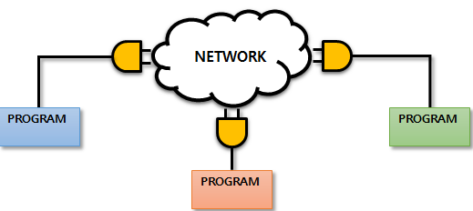

# Network

* 유선, 무선을 이용해서 데이터 통신을 하기 위해 컴퓨터를 논리적, 물리적으로 묶어놓은 형태

## network 형태

> 크기에 따라서 여러가지 형태로 구분
>
> **트레픽을 최소화** 하기 위해 구분

1. LAN - Local Area Network
   * 근거리 통신망(집, 사무실)
2. WAN - Wide Area Network
   * 광역 통신망
3. MAN - Metropoitan Area Network
   * 도시 지역 통신망(도시 하나의 단위)

## Internet

* Internet - Network of Network
  * 물리적인 네트워크 형태

### Service

* Internet 을 사용하기 위해서는 그 위에서 동작하는 Service가 있어야 한다.
  1. Web
  2. EMAIL
  3. Torrent
  4. Streaming
* Interntet위에서 각각의 서비스가 동작하려면 각 컴퓨터들이 서로를 인지할수 있는 수단이 필요
  * 각 컴퓨터마다 주소를 부여할 필요가 있다.
    * NIC - Network Interface Card => LAN Card
    * LAN Card에 IP Adress를 부여
      * IPv4 => xxx.xxx.xxx.xxx 
        * 초창기에 사용, 초기에는 문제없이 사용, 시간이 자나면서 주소수가 모자라지게됨
      * IPv6
        * 기존 주소를 확장해 만들어 짐

### IP Address(IPv4)

* LAN Card에 부여된 논리적 주소
  * 논리적 주소만으로는 컴퓨터간의 통신을 할 수 없다.
  * 물리적인 주소가 있어야 통신을 할수 있으며 이 **물리적 주소**를 **MAC Address**라고 한다
    * 내부적으로 논리적인 주소가 물리적 주소로 변환해 Network 사용
  * 논리적 주소 - 변경이 가능한 주소(IP주소)
  * 물리적 주소 - NIC에 고정이 되어있어 변경이 불가(MAC 주소)
* IP Address를 이용해서 특정 컴퓨터를 찾을 수 있다.
  * 숫자이기 때문에 기억하기가 쉽지 않아 도메인 네임을 사용
    * DNS(Domain Name System)를 도입  => www.goolge.com

* IP Address를 알아야 통신하고자 하는 상대방 컴퓨터를 인지 할 수 있다.
  * Protocol필요
    * TCP, IP ,ARP, TELNET, FTF, HTTP
  * Port - 컴퓨터내에 동작하고 있는 프로그램을 지칭하는 숫자
    * 숫자 0 ~ 65635 범위를 가지는 숫자 (Program에 할당된 번호)
    * 0 ~ 1023번까지는 예약이 되어 있다.
* 컴퓨터간 데이터를 주고 받으러면
  1. Protocol을 알아야한다
  2. IP Address를 알아야한다.
  3. Port 번호를 알아야한다

## Socket

* Network프로그램이 어려워 등장
* 복잡한 네트워크 처리
* 데이터를 송수신할 수 있도록 네트워크 환경에 연결할 수 있게 만들어진 연결부

 

* Output Stream
* Input Stream


## Java Network

* 프로그램은 CS구조를 자긴자 (Client Server)

   

* JavaNetwork 기본 예제

  * client

  ```java
  try {
      Socket socket = new Socket("localhost",5556);
      BufferedReader br = new BufferedReader(new InputStreamReader(socket.getInputStream())); //입력 Stream
      String msg = br.readLine();
      printMsg(msg);
      br.close(); //Stream close
      socket.close(); //socket close
  } catch (UnknownHostException e1) {
      e1.printStackTrace();
  } catch (IOException e1) {
      e1.printStackTrace();
  }
  ```

  * Server

  ```java
  try {
      ServerSocket server = new ServerSocket(5556);
      System.out.println("Server Create");
      // 2.Client 의 적속을 기다리기 위한 Method 호출
      // Client socket에 연결 
      Socket socket = server.accept(); // Blocking method => Client가 접속할때 까지 대기
      System.out.println("Client Connection");
      // 3.Socket이 생셩되면 데이터 입출력하기 위해 Stream을 생성
      String date = (new Date()).toLocaleString(); //현재 시간 구함
      PrintWriter out = new PrintWriter(socket.getOutputStream());
      out.println(date);
      out.flush();
      out.close(); //stream close
      socket.close(); //Client와 연결된 socket close
      server.close(); //ServerSocket close
  } catch (IOException e) {
      e.printStackTrace();
  } 
  ```

* Echo Program 예제

  * 클라이언트가 데이터를 서버에 전송
  * 서버가 데이터를 받아서 다시 클라이언트에게 전송
  * 전송받은 데이터를 TextArea에 출력
  * 위 작업 반복 (클라이언트가 EXIT를 입력 할떄까지)

  ```java
  EchoClient.class
  
  connButton.setOnAction(e -> {
      try {
          // 연결되면 TextArea의 내용 지운다
          textArea.clear();
          socket = new Socket("localhost", 5556);
          printMsg("Server Connection Success");
          textField.setDisable(false); // 입력상자 활성화
          printWriter = new PrintWriter(socket.getOutputStream());
          bufferedReader = new BufferedReader(
              new InputStreamReader(socket.getInputStream())); // 입력
  
      } catch (UnknownHostException e1) {
          e1.printStackTrace();
      } catch (IOException e1) {
          e1.printStackTrace();
      }
  });
  
  textField = new TextField();
  textField.setPrefSize(400, 50);
  textField.setDisable(true); // textField를 처음에 사용할수 없게 설정
  //Enter 를 치면 Action
  textField.setOnAction(e -> {
      String msg = textField.getText();
      printWriter.println(msg);
      printWriter.flush();
      textField.clear();
      if(!msg.equals("@EXIT")) {
          try {
              String revString = bufferedReader.readLine();
              printMsg(revString);
          } catch (IOException e1) {
              e1.printStackTrace();
          }
      }else {
          printMsg("Servier Connection END");
          textField.setDisable(true);
          if(printWriter != null) {
              printWriter.close(); //OutputStream close
          }
          if(bufferedReader != null) {
              try {
                  bufferedReader.close();
              } catch (IOException e1) {
                  e1.printStackTrace();
              } //InputStream close
          }
          if(socket != null) {
              try {
                  socket.close();
              } catch (IOException e1) {
                  e1.printStackTrace();
              } //Client와 연결된 socket close
          }
      }
  });
  ```

  ```java
  EchoServer.class
  
  try {
      ServerSocket server = new ServerSocket(5556);
      System.out.println("Server Create");
      // .Client 의 적속을 기다리기 위한 Method 호출
      // Client socket에 연결 
      Socket socket = server.accept(); // Blocking method => Client가 접속할때 까지 대기
      System.out.println("Client Connection");
      // 3.Socket이 생셩되면 데이터 입출력하기 위해 Stream을 생성
  
      BufferedReader bufferedReader = new BufferedReader(
          new InputStreamReader(socket.getInputStream())); //입력 Stream			
      PrintWriter printWriter = new PrintWriter(socket.getOutputStream());
      String msg = "";
      while(true) {
          msg = bufferedReader.readLine();  //클라이언트로 부터 데이터를 받아오는게 없으면 해당 Line에 멈춰있다.
          if(msg == null || msg.equals("@EXIT")) {
              break;
          }
          printWriter.println(msg);
          printWriter.flush();
      }
      if(printWriter != null) {
          printWriter.close(); //OutputStream close
      }
      if(bufferedReader != null) {
          bufferedReader.close(); //InputStream close
      }
      if(socket != null) {
          socket.close(); //Client와 연결된 socket close
      }
      if(server != null) {
          server.close(); //ServerSocket close
      }
      System.out.println("Server END");
  } catch (IOException e) {
      e.printStackTrace();
  } 
  ```

### 1 : N 통신

* Server Program이 accept() 작업을 반복하고 Input/outputStream 작업을 Thread에 할항 해준다


# 참고 사이트

[Networ Socket](https://recipes4dev.tistory.com/153)