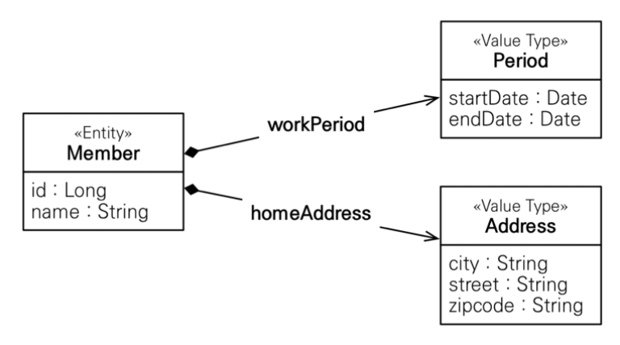

# Annotation

## @Embedded

* 새로운 값 타입을 직접 정의해서 사용
* 장점
  * 재사용
  * 높은 은집도
  * 해당 값 타입만 사용하므로 의미있는 메서드를 만들 수 있다.

### 사용방법

>* @Embeddable - 값 타입을 정의하는 곳에 표시
>* @Embedded - 값 타입을 사용하는 곳에 표시
>* **임베디드 타입은 기본 생성자가 필수이다.**

* 임베디드 타입을 포함한 모든 값 타입은 앤티티의 생명주기에 의존하므로 엔티티와 임베디드 타입 관게를 UML로 표현하면 **컴포지션(composition)관계**가 된다.

* 임베디드 타입(복합 값 타입) 사용 비교

  * 임베디드 타입 사용하지 않았을 때

  ```java
  @Entity
  public class Member {
    
    @Id @GeneratedValue
    private Long id;
    private String name;
    
    // 근무 기간
    @Temporal(TemporalType.DATE)
    Date startDate;
    @Temporal(TemporalType.DATE)
    Date endDate;
    
    // 집 주소 표현
    private String city;
    private String street;
    private String zipcode;
  }
  ```

  * 임베디드 타입 적용

  ```java
  // 임베디드 타입 사용
  @Entity
  public class Member {
    
    @Id @GeneratedVAlue
    private Long id;
    private String name;
    
    @Embedded
    private Period workPeriod;	// 근무 기간
    
    @Embedded
    private Address homeAddress;	// 집 주소
  }
  
  // 기간 임베디드 타입
  @Embeddable
  public class Peroid {
    
    @Temporal(TemporalType.DATE)
    Date startDate;
    @Temporal(TemporalType/Date)
    Date endDate;
    // ...
    
    public boolean isWork (Date date) {
      // .. 값 타입을 위한 메서드를 정의할 수 있다
    }
  }
  
  @Embeddable
  public class Address {
    
    @Column(name="city") // 매핑할 컬럼 정의 가능
    private String city;
    private String street;
    private String zipcode;
    // ...
  }
  ```

### [Reference](https://velog.io/@conatuseus/JPA-%EC%9E%84%EB%B2%A0%EB%94%94%EB%93%9C-%ED%83%80%EC%9E%85embedded-type-8ak3ygq8wo)

