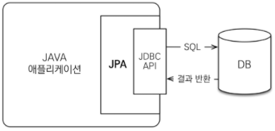

# JPA

> * Java ORM 기술에 대한 표준 명세로, Java에서 재공하는 API
> * Java 어플리케이션에서 관계형 데이터베이스를 사용하는 방식을 정의한 인터페이스
> * ORM이기 때문에 자바 클래스와 DB테이블을 매핑한다.

* ORM
  * Object-Relation Mapping
  * DB테이블을 Java객체로 매핑함으로써 객체간의 관계를 바탕으로 **SQL을 자동으로 생성**
  * RDB의 관계를 Object에 반영하는 것이 목적
  * DB데이터 <--mapping--> Object필드
    * 객체를 통해 간접적으로 DB데이터를 다룬다.
  * 객체와 DB의 데이터를 자동으로 매핑해준다.
    * SQL쿼리가 아니라 메서드로 데이터를 조작할 수 있다.
    * 객체간 관계를 바탕으로 sql을 자동으로 생성

## JPA동작 과정

* JPA는애플리케이션과 JDBC사이에서 동작한다.

 

* MemberDAO에서 객체를 저장하고 싶을 때 개발자는 JPA에 Member객체를 넘긴다.
  1. Member엑티티를 분석
  2. INSERT SQL을 생성
  3. JDBC API를 사용하여 SQL을 DB에 날린다.

 

* Member의 PK값을 JPA에 넘긴다
  1. 엔티티의 매핑 정보를 바탕으로 적절한 SELECT SQL을 생성
  2. JDBC API를 사용하여 SQL을 DB에 날린다
  3. DB로부터 결과를 받아온다.
  4. 결과fmf rprcpdp ahen aovldgksek
     * 쿼리를 JPA가 만들어 주기 때문에 Object와 RDB 간의 패러다임 불일치를 해결할 수 있다.

 

## JPA 특징

