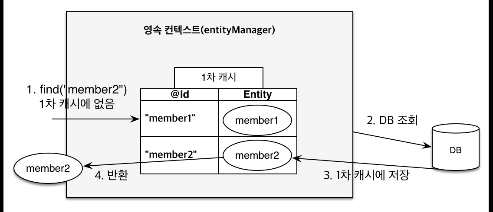
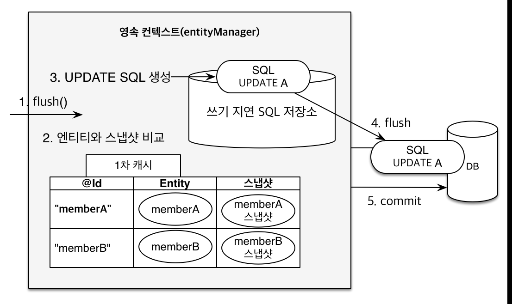

# 영속성 컨텍스트

> * 엔티티를 영구 저장하는 환경
> * 엔티티 매니저를 통해서 영속성 컨텍스트에 접근


## 엔티티의 생명주기

* 비영속(new/transient)

  * 영속성 컨텍스트와 전혀 관계가 없는 **새로운** 상태

  ```java
  //비영속
  Member member = new Member();
  member.setId(100);
  member.setName("name");
  ```

* 영속(managed)

  * 영속성 컨텍스트에 **관리**되는 상태

  ```java
  //영속
  em.persist(member);
  ```

* 준영속(detached)

  * 영속성 컨텍스트에 저장되었다가 **분리**된상태

  ```java
  em.detach(member) => //영속성 컨텍스트에서 지운다 (관계x)
  ```

* 삭제(remove)

  * 삭제된 상태

  ```java
  em.remove(member) => //DB삭제 요청 상태(영구 저장한 DB에서 제거)
  ```

## 영속성 컨텍스트의 이점

* 1차 캐시

  * 1차 캐시에서 조회

  ```java
  Member member = new Member();
  member.setId("member1");
  member.setUsername("회원1");
  //1차 캐시에 저장됨
  em.persist(member);
  //1차 캐시에서 조회
  Member findMember = em.find(Member.class, "member1");
  ```

  

  * 데이터베이스에서 조회

  ```java
  Member findMember2 = em.find(Member.class, "member2");
  ```

  

  

* 동일성(identity) 보장

  * 1차 캐시로 반복 가능한 읽기 등급의 트랜잭션 격리 수준을 데이터베이스가 아닌 애플리케이션 차원에서 제공

  ```java
  Member a = em.find(Member.class, "member1");
  Member b = em.find(Member.class, "member1");
  System.out.println(a == b); //동일성 비교 true
  ```

  

* 트랜택션을 지원하는 쓰기 지연(transactional write-behind)

  ```java
  EntityManager em = emf.createEntityManager();
  EntityTransaction transaction = em.getTransaction();
  
  //엔티티 매니저는 데이터 변경시 트랜잭션을 시작해야 한다.
  transaction.begin(); // [트랜잭션] 시작
  em.persist(memberA);
  em.persist(memberB);
  //여기까지 INSERT SQL을 데이터베이스에 보내지 않는다.
  //커밋하는 순간 데이터베이스에 INSERT SQL을 보낸다.
  transaction.commit(); // [트랜잭션] 커밋
  ```

  * em.persist();

  

  * transaction.commit();

  

  

* 변경 감지(Dirty Checking)

  * 스냅샷을 찍어두고 Entity와 스냅샷을 비교해 변경을 감지하여 DB에 변경된 사항을 반영

  ```java
  EntityManager me = emf.createEntityManager();
  EntityTransaction transaction = em.getTransaction();
  transcation.begin(); //[Transaction] 시작
  
  //영속 엔티티 조회
  Member memberA = em.find(Member.class, "memberA");
  
  //영속 엔티티 데이터 수정
  memberA.setUsername("memberB");
  memberA.setAge(10);
  
  transaction.commit(); //[Transcation] 커밋
  ```

  

  

* 엔티티 삭제

  ```java
  Member memberA = em.find(Member.class, "memberA");
  
  em.remove(memberA); //엔티티 삭제
  ```

  

## 플러시

* 영속성 컨텍스트의 변경내용르 데이터베이스에 반영
* 플러시 발생
  * 변경 감지
  * 수정된 엔티티 쓰기 지연 SQL저장소에 등록
  * 쓰기 지연SQL저장소의 쿼리를 데이터베이스에 전송(등록, 수정, 삭제 쿼리)
* 영속성 컨텍스트를 플러시하는 방법
  * em.flush() - 직접 호출
  * 트랜잭션 커밋 - 플러시 자동 호출
  * JPQL 퀴리 실행 - 플러시 자동 호출
* 영속성 컨텍스트를 비우지 않음
* 영속성 커넥스트의 변경내용을 데이터베이스에 동기화
* 트랜잭션이라는 작업 단위가 중요 -> 커밋 직전에만 동기화 하면 됨
* 준영송 상태
  * 영속 상태의 엔티티가 여속성 컨텍스트에서 분리(detached)
  * 영속성 컨텍스트가 제공하는 기능을 사용 못함
  * 준영속 상태로 만드는 방법
    * em.detach(entity) - 특정 엔티티만 준영속 상태로 전환
    * em.clear() - 영속성 컨텍스트를 완전히 초기화
    * em.close() - 영속성 컨텍스트를 종료