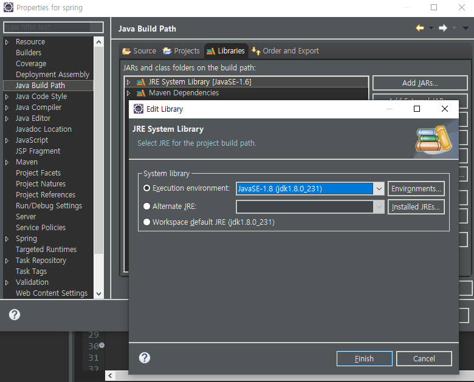
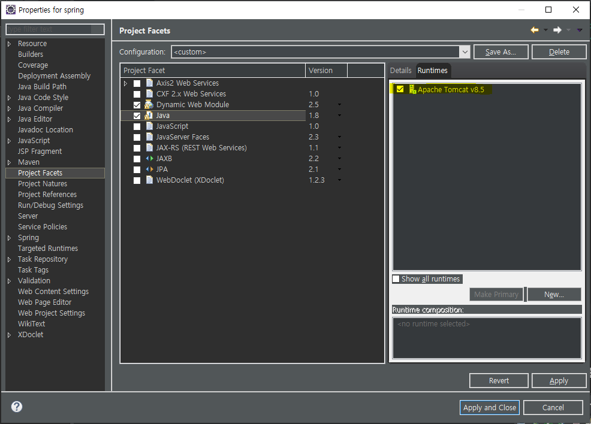
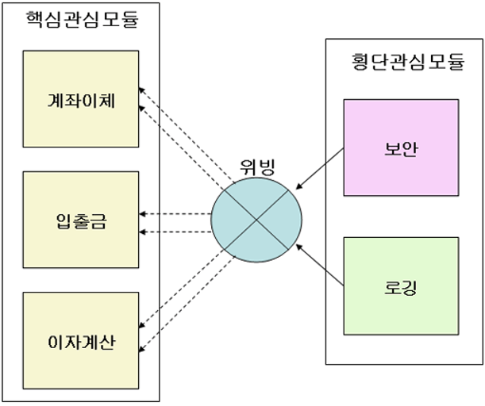
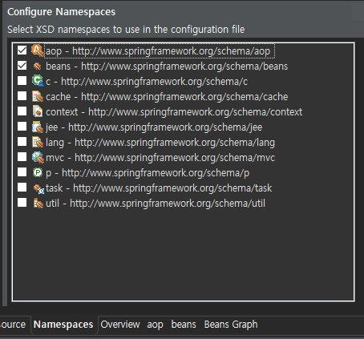

# Spring

> 조성희 강사(bluejeansh@hanmail.net)
>
> DAY 1. DI / MVC / mybatis
>
> DAY 2. AOP 

1. 여러가지 모듈 단위

2. Class A  extends HttpServlet

   Class B : main class실행 / 서블릿 실행/ 안드로이드 앱 실행 = plain old java object (pojo)

3. spring 이전 개발 자바 객체를 그대로 재사용 가능.

4. Spring Core - ID

* IOC 기능 지원

  * Inversion of control

  * IOC 기능 지원 =>스프링 내부 프로그래밍 방식 DI

  * DEPNDENCY INJECTION

    1.생성자

    2.setter

    ```java
    class A{
        B b1 = new B();
    }
    
    class Main(){
        
        A a1 = new A(new C());
        
    }
    
    //외부에서 전달 받음
    class A{
        B b1 = C객체, D객체;
        
        A(B b1){
            this.b1 = b1;
        }
        
        set(B b1){
            this.b1 = b1;
        }
    }
    
    interface B{}
    
    class c implements B(){
        
    }
    class D implements B(){
        
    }
    ```

    

## 환경설정

* Tomcat 8.5
* JDK 1.8
* Eclipse - Spring Tools 3(Standard Edition) - install
* Spring 4


## 프로젝트 생성


## 환경 설정 (POM.xml 수정)

```java
<?xml version="1.0" encoding="UTF-8"?>
<project xmlns="http://maven.apache.org/POM/4.0.0" xmlns:xsi="http://www.w3.org/2001/XMLSchema-instance"
	xsi:schemaLocation="http://maven.apache.org/POM/4.0.0 https://maven.apache.org/maven-v4_0_0.xsd">
	<modelVersion>4.0.0</modelVersion>
	<groupId>edu.multi</groupId>
	<artifactId>mvc</artifactId>
	<name>spring</name>
	<packaging>war</packaging>
	<version>1.0.0-BUILD-SNAPSHOT</version>
	<properties>
		<java-version>1.8</java-version>   //1.6 에서 1.8 로
		<org.springframework-version>4.3.18.RELEASE</org.springframework-version>  //3.1.1 에서 4.3.18로
```

* 수정 확인


우클릭 - Properties

* javaSE-1.6 에서 1.8 로 수정



* 1.8로 변경 되었는지 확인


* java 1.6 dptj 1.8로 수정


* Tomcat 8.5 Check



* 3개 Libraries 있는지 확인

  > Tomcat - Apache Tomcat v8.5
  >
  > jdk - JRE System Libray
  >
  > spring - Maven Dependencies


## DI -IoC

- pojo : 스프링/web/일반main 재사용 자바 객체
- 스프링 자바객체 = spring bean

1. 스프링 같은 이름 같은 타입 객체 1개 생성(공유) -singleton

2. 스프링 공장 생성 객체만 전달 - xml 파일에 요청.

3. 스프링 규칙대로 강제적으로 사용.

4. TAG - <bean>, <property>

5. @ 

    스프링은 여러가지 설정 XML파일을 사용. 또는 @(annotation).

### IOC

* 기능 - DL / DI
  * DL 은 사용하지않음
  * DI - Constructor DI/ Setter DI

* inversion of control

> 왜ㅣ부 객체 전달(new 사라지고 xml 파일 설정)

```xml
<?xml version="1.0" encoding="UTF-8"?>
<beans xmlns="http://www.springframework.org/schema/beans"
	xmlns:xsi="http://www.w3.org/2001/XMLSchema-instance"
	xsi:schemaLocation="http://www.springframework.org/schema/beans http://www.springframework.org/schema/beans/spring-beans.xsd">

	<bean id='tv' class='tvspring.OtherTV'></bean>
	<bean id='tv2' class='tvspring.MultiTV'></bean>
	
</beans>
```

```java
package tvspring;

import org.springframework.context.ApplicationContext;
import org.springframework.context.support.ClassPathXmlApplicationContext;

public class Main {

	public static void main(String[] args) {
		ApplicationContext factory = new ClassPathXmlApplicationContext("tvspring/tv.xml");

		TV tv = factory.getBean("tv", TV.class);  //TV Type
		tv.powerOn();
		tv.soundUp();
		tv.soundDown();
		tv.powerOff();
		
		TV tv2 = factory.getBean("tv2", TV.class);  //TV Type
		tv2.powerOn();
		tv2.soundUp();
		tv2.soundDown();
		tv2.powerOff();
	}
}
```

```java
package tvspring;

//모든 tv들은 메소드 공통 약속: 구혀ㅑㄴ방법 다르다.
//상속 다른 클래스 '의무적' 메소드 Override

public interface TV {
	public void powerOn();
	public void powerOff();
	public void soundUp();
	public void soundDown();
}
```

```jade
package tvspring;

public class MultiTV implements TV{
	
	
	public void powerOn() {
		System.out.println("멀티 tv:전원 켜다");
	}
	public void powerOff() {
		System.out.println("멀티 tv:전원 끄다");
	}
	
	public void soundUp() {
		System.out.println("멀티 tv:볼륨 높이다");
	}
	public void soundDown() {
		System.out.println("멀티 tv:볼륨 낮추다");
	}

}
```


DO - 

값 접근 객체 :JDBC/ io/네트워크  DAO - Data access object

갑 저장 객체 = DATA OBJECT = Value object


### Costructor DI


### Setter DI

> DI: 스프링 객체 전달 받자.

```xml
<?xml version="1.0" encoding="UTF-8"?>
<beans xmlns="http://www.springframework.org/schema/beans"
	xmlns:xsi="http://www.w3.org/2001/XMLSchema-instance"
	xsi:schemaLocation="http://www.springframework.org/schema/beans http://www.springframework.org/schema/beans/spring-beans.xsd">

<bean id="vo" class="empspring.EmpVO">
	<property name="name" value="김사원"></property>
	<property name="salary" value="10000"></property>
	<property name="deptname" value="교육부"></property>
</bean>

<bean id="dao" class="empspring.EmpDAO">
	<property name="vo" ref="vo"/>
</bean>

</beans>
```

```java
package empspring;

import org.springframework.context.ApplicationContext;
import org.springframework.context.support.ClassPathXmlApplicationContext;

public class EmpMain {

	public static void main(String[] args) {
		ApplicationContext factory = new ClassPathXmlApplicationContext("empspring/Emp.xml");
		//Spring Bean configuration XML
		EmpDAO dao = factory.getBean("dao",EmpDAO.class);
		
		dao.insertEmp();
	}

}
```

```java
package empspring;

public class EmpVO {
	
	private String name;
	private double salary;
	private String deptname;
	
	public String getName() {
		return name;
	}
	public void setName(String name) {
		this.name = name;
	}
	public double getSalary() {
		return salary;
	}
	public void setSalary(double salary) {
		this.salary = salary;
	}
	public String getDeptname() {
		return deptname;
	}
	public void setDeptname(String deptname) {
		this.deptname = deptname;
	}
}
```

```java
package empspring;

public class EmpDAO {
	//FORM - 사원정보 - DB저장 메소드
	EmpVO vo;
	
	public void setVo(EmpVO vo) {
		this.vo = vo;
	}
	public void insertEmp() {
		//EmpVO객체 1개 생성(김사원 10000 교육부)
		System.out.println(vo.getName() + "사원은" + vo.getSalary() + "급여를 받으며" + vo.getDeptname() + "부서이다");
	}
}
```

#### Singleton

> singleton 방식 - 생성된 객체를 공유(아래 code에 여러번 호출해도 하나의 객체만을 공유사용)

```java
package empspring;

import org.springframework.context.ApplicationContext;
import org.springframework.context.support.ClassPathXmlApplicationContext;

public class EmpMain {

	public static void main(String[] args) {
		ApplicationContext factory = new ClassPathXmlApplicationContext("empspring/Emp.xml");
		//Spring Bean configuration XML
		//스프링 설정내용 객체생성 1 개 공유 - singleton 방식 - 생성된 객체를 공유
		EmpDAO dao = factory.getBean("dao",EmpDAO.class);
		//dao.insertEmp();
		
		//스프링 설정내용 객체생성 2 생성자 2
		EmpDAO dao1 = factory.getBean("dao",EmpDAO.class);
	}
}
```


### Anootation

* Repository - 클래스위 선언

* Service -클래스위 선언

* Component -클래스위 선언

* Autowired -맴버변수, 생성자 , sertter 위에 선언

* Resource -맴버변수, 생성자 , sertter 위에 선언

* Qualifier -맴버변수, 생성자 , sertter 위에 선언 ex) B type 객체가 여러개 즉 ,b1 or b2 가 있을때

  Qualifier("b2") 처럼 선언하면 b2객체를 불러온다.

>@Repository("dao")
>
>@Repository - () 가 없으면 class 이름 적용
>
>@Conponent - () => Repositoy 와 동일
>
>@Autowired  --> 유일하게 객체가아닌 변수 위에 위치


##### TAG추가 _(context)


```xml
<?xml version="1.0" encoding="UTF-8"?>
<beans xmlns="http://www.springframework.org/schema/beans"
	xmlns:xsi="http://www.w3.org/2001/XMLSchema-instance"
	xmlns:context="http://www.springframework.org/schema/context"
	xsi:schemaLocation="http://www.springframework.org/schema/beans http://www.springframework.org/schema/beans/spring-beans.xsd
		http://www.springframework.org/schema/context http://www.springframework.org/schema/context/spring-context-4.3.xsd">

<!-- @Repository, @Component, ->bean tag 대신 객체생성
	@Autowrired  -> property 대신
	설정 인식 표현 -->
	
<context:component-scan base-package="annotation.empspring"></context:component-scan>

<bean id="vo" class="annotation.empspring.EmpVO">
	<property name="name" value="김사원"></property>
	<property name="salary" value="10000"></property>
	<property name="deptname" value="교육부"></property>
</bean>

</beans>
```


### VO  

> 값 임시 저장소

### DAO

> 값 접근 객체
>
> 1개 sql 실행 단위 = 1개 method

### service

> 1개 기능 단위(예 : 회원가입)
>
> 

#### ex)회원 가입

0. select id
1. insert(EmpVO v0) sql

| 입력/출력    | 서비스단 | DAO         | VO         | DataBase |
| ------------ | -------- | ----------- | ---------- | -------- |
| main/servlet | Service  | @Repository | @Component |          |


## AOP

> ASPECT ORIENTED PROGRAMMING
>
> 구현 필요 - 핵심관심코드 = 종단관심코드
>
> Weaving
>
> aspect - 모든 스프링 클래스 공통 구현 사항(공통관심코드 = 횡단관심코드 = 핵심관심코드)
>
> ​			- 구현 공통 필요 반복 구현 사항들
>
> (반복적 코딩 필요 - 한번 정의 - 필욯나 클래스에 연결/해제)

### weaving

> 핵심관심모듈과 횡단관심 모듈은 연결해주는 역할




### 자바개발자 디자인 패턴 23 가지

#### 1. proxy

```java
package proxypattern;

public class ProxyMain {

	public static void main(String[] args) {
		ProxyInter p = new C();
		B b1 = new B(); //A, C객체 실행 공통 실행 내용 객체
		
		b1.setP(p);
		b1.action();//B +(A or c)  ==>B 는 공통관심 , A or C 는 핵심관심
	}
}

```

```java
package proxypattern;

public interface ProxyInter {
	public void action();
}
```

```java
package proxypattern;

public class A implements ProxyInter{
	
	@Override
	public void action() {
		System.out.println("A class action");
	}
}


package proxypattern;

public class B implements ProxyInter{
	
	ProxyInter p;
	
	public void setP(ProxyInter p) {
		this.p = p;
	}
	@Override
	public void action() {
		System.out.println("B class action stat");
		p.action();
		System.out.println("B class action end");
	}
}

package proxypattern;

public class C implements ProxyInter{
	
	@Override
	public void action(){
		System.out.println("C class action");
	}
}

```


### AOP Libraries

#### [AspectJ Weaver](https://mvnrepository.com/artifact/org.aspectj/aspectjweaver) » [1.9.2](https://mvnrepository.com/artifact/org.aspectj/aspectjweaver/1.9.2) Libraries


```xml
		
				<!-- https://mvnrepository.com/artifact/org.aspectj/aspectjweaver -->
		<dependency>
		    <groupId>org.aspectj</groupId>
		    <artifactId>aspectjweaver</artifactId>
		    <version>1.9.2</version>
		    <scope>runtime</scope>
		</dependency>
		
	</dependencies>

xml 파일에 붙여넣기
```

libraries 추가 확인


#### aop pointcut예제1



```xml
<?xml version="1.0" encoding="UTF-8"?>
<beans xmlns="http://www.springframework.org/schema/beans"
	xmlns:xsi="http://www.w3.org/2001/XMLSchema-instance"
	xmlns:aop="http://www.springframework.org/schema/aop"
	xsi:schemaLocation="http://www.springframework.org/schema/beans http://www.springframework.org/schema/beans/spring-beans.xsd
		http://www.springframework.org/schema/aop http://www.springframework.org/schema/aop/spring-aop-4.3.xsd">
	
	<bean id="member" class="aop1.Member"></bean>
	<bean id="board" class="aop1.Board"></bean>
	<bean id="common" class="aop1.Common"></bean>
	
	<aop:config>
		<aop:pointcut expression="execution(public * aop1.*.*(..))" id="pc"/> 리턴타입 패키지명.클래스명.메소드(매개변수) 
		<aop:aspect id="aspect1" ref='common'>
			<aop:before method="dateTime" pointcut-ref="pc"/>
		</aop:aspect>
	</aop:config>

</beans>
```

> ​     = > 리턴타입 패키지명.클래스명.메소드(매개변수)
>
> *** :** **모든 **
>
> **(..) : 모든 매개변수**
>
> **.. :** **하위패키지 포함** 

#### pointcut

>● execution 명시자 : Advice를 적용할 메서드를 명시할 때 사용
>
> 기본 형식  execution(리턴타입 패키지명.클래스명.메소드(매개변수) )
>
> ▶ 수식어패턴 : public, private 등등의 수식어를 명시, 생략 가능
>
> ▶ 리턴타입 : 리턴 타입을 명시
>
> ▶ 클래스이름, 이름패턴 : 클래스 이름 및 메서드이름을 패턴으로 명시
>
> ▶ 파라미터패턴 : 매칭될 파라미터에 대해 명시
>
> ▶ '*' : 모든 값을 표현
>
> ▶ '..' : 0개 이상을 의미

#### within 명시자

> 특정 타입에 속하는 메서드를 PointCut으로 설정 할떄 사용

```xml
 within(sp.aop.service.*)

  => sp.aop.service 패키지에 있는 모든 메서드

 within(sp.aop.service..*)

  => sp.aop.service 패키지 및 하위 패키지에 있는 모든 메서드
```

#### bean 명시자

> Spring bean 이름을 이용하여 PointCut을 정의

```xml
bean(faqBoard)

  => 이름이 faqBoard인 빈의 메서드 호출

bean(*noticeBoard)

  => 이름이 noticeBoard로 끝나는 빈의 메서드 호출
```

#### Aspect

> **@Before** (이전) : 어드바이스 타겟 메소드가 호출되기 전에 어드바이스 기능을 수행
>
> **@After (이후)** : 타겟 메소드의 결과에 관계없이(즉 성공, 예외 관계없이) 타겟 메소드가 완료 되면 어드바이스 기능을 수행
>
> @AfterReturning (정상적 반환 이후)타겟 메소드가 성공적으로 결과값을 반환 후에 어드바이스 기능을 수행
>
> @AfterThrowing (예외 발생 이후) : 타겟 메소드가 수행 중 예외를 던지게 되면 어드바이스 기능을 수행
>
> **@Around** (메소드 실행 전후) : 어드바이스가 타겟 메소드를 감싸서 타겟 메소드 호출전과 후에 어드바이스 기능을 수행

## MVC

> Web 프로그램 3가지
>
> html
>
> javaScript+jQuery
>
> serrblet+jsp

| web client 실행 ,<br />요청= |      |
| ---------------------------- | ---- |
|                              |      |

web 서버

> http 요청 -> servlet ->DAO ->DB ->VO->JSP

servlet - 클라이언트 요청 받아서 분석(회원가입, 조회 :id, pw, name...) =>결과 생성 객체 생성, 메소드 호출

jsp -브라우저  전달(html)

dao - 요청 기증 1개 수행

vo - data return

## mybatis

> data Base 이연결 == jdbc
>
> 현업에서 주로 사용 


# 사이트

[android](https://elfinlas.tistory.com/category/DevF/Android)


