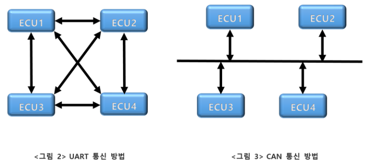
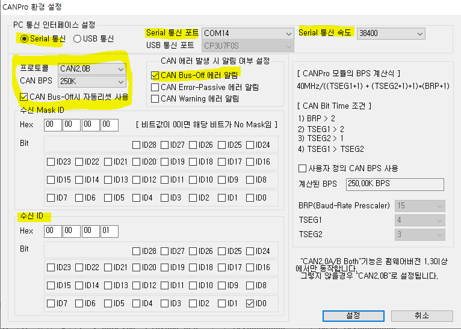
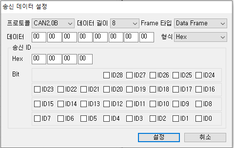
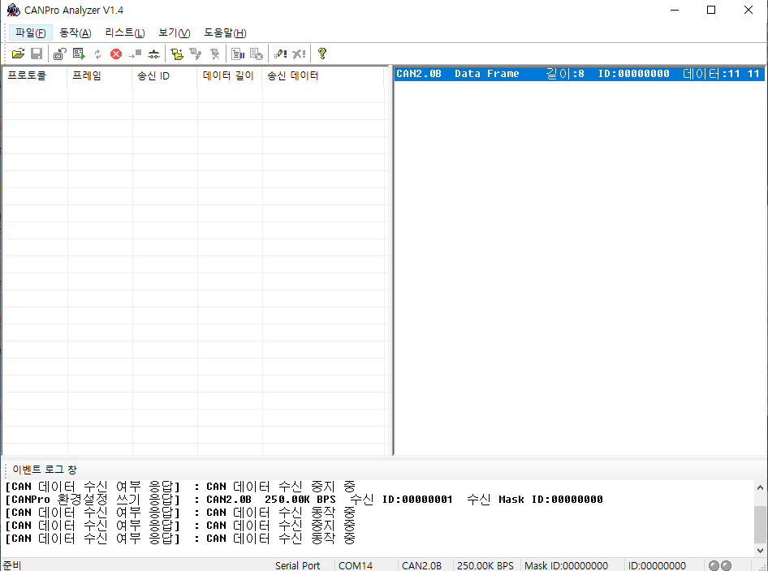
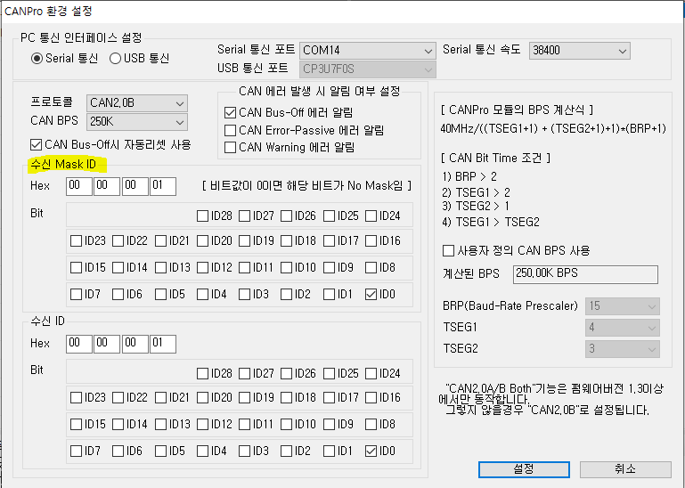
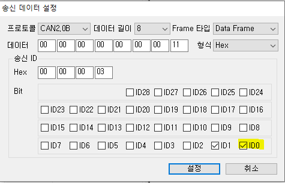

# CAN Protocal

> Controller Area Network

* 자동차에 국한된 Network
* ECU(Electronic Control Unit) 간에 데이터 통신
* 견고한 네트워크 구조
* 속도가 느려 많은 양의 데이터를 보낼수가 없다
* CSMA/CD

 

* 프레임 구조

 

## 장점

* CAN은 Multi Master형식으로 통신을 한다
  * 서버와 클라이언트의 개념이 아니다(JavaNetwork 참고)
* 노이즈에 강한 Network
* 표준 프로토콜
* CRC를 이용해서 하드웨어적 오류체크 간으
* CAN BUS를 이용해서 전선의 양을 획기적으로 줄일 수 있다.

## ECU

* ACU(Airbag Control Unit)
  * 에어백 관련
* BCM(Body Control Module) 
  * 자동차의 각종 정보들을 제어
* ECU(Engine Cotrol Unit)
  * Engine Control
* TCU(Tansmission Control Unit)
  * 변속기 제어
* ABS(Anti-lock Breaking System)
  * 브레이크 제어

## Setting

* 시작 - 설정 - 업데이트및 보안 - 복구 - 고급시작 옵션 - 지금 다시시작 - 시작설정 - 드라이버서명 적용 안함 (7번 key)
* 제어판 - 하드웨어및 소리 - 장치관리자 - 기타장치or포트 에 표시되면 연결 완료

* RealSYS_USB 파일 압축 풀기 - dp-chooser.exe관리자 권한으로 실행

  * 장치관리자에 포트 - USB Serial Port(COM N)으로 표시 되어야함

  

* CANPro.exe설치

   

* 실행 - 동장 - CANPro환경 설정 쓰기(장비 설정)

  

* CAN DATA수신 시작 Click

* 우클릭 송신데이터 추가

  

* CAN DATA 송신 Click
* 수신자 화면 우측에 데이터 표시됨

* 수신쪽 MaskID Check
  * mask를 체크하지 않으면 모든 데이터를 받는다
  * 아래 체크는 맨마지막 BIt만 체크해서 확인하여 데이터 수신함
  * 데이터를 전송 하려면 송신쪽에서는 수신쪽에 Check된 BIt가 Check되어 있어야 한다
    * 해당 BIt는 반드시 동일하게 Check되어야하고 나머지 BIt는 Check, NonCheck상관 없다
* 수신 Bit Check

* 송신 Bit Check

