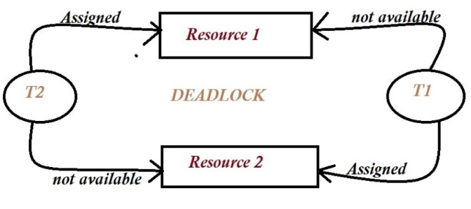

# DeadLock

> 고착 상태 - 서로다른 두개의 작업(Tranjaction)이 Resource 잠금을 교차해서 획득 할 때 발생



## Deadlock형성 조건

1. Mutual Exclusion - 상호 배제

   * 매 순간 하나의 프로세스 만이 자원을 사용할 수 있다.

2. No Preemption - 비선점

   * 프로세스는 자원을 스스로 내어놓을 뿐 interrupt등에 의해서 강제로 반환되지 않는다
   * 자우너이 강제로 반환된다면, 데드락이 발생할 가능성은 없다.

3. hold and Wait - 점유와 대기

   * 자원을 갖고 있는 프로세스가 다른 자원을 기다릴 때 보유 자원을 반환하지 않고 계속 보유하고 있어야 한다.
   * 내놓지 않은 상태에서 추가적인 요청을 해야 Deadlock이 발생

4. Circular wait - 환형대기

   * 1,2,3의 조건들을 만족하며넛 서로가 가진 자원을 서로가 기다리는 프로세스가 존재해야한다.
   * 프로세스간의 사이클이 형성되어야 한다.

   

## Deadlock 처리 방법

### Semaphore

* 공유된 자원의 데이터를 여러 프로세스가 접근하는 것을 막는 것
* 운영체제의 리소스를 경쟁적으로 사용하는 다중 프로세스에서 행동을 조정하거나 또는 동기화 시키는 기술
* 확인되는 세마포어의 값에따라 그 프로세스가 즉시 자원을 사용할 수있거나, 이미 다른 프로세스에 의해 사용중이라는 사실을 아렉 되면 재시도하기 전에 일정 시간을 기다려야한다.

### Mutex

> 객체를 두 쓰레드가 동시에 사용할 수 없다.

* 공유된 자원의 데이터를 여러 쓰레드가 접근하는 것을 막는 것
* Critical Section을 가진 쓰레드들의 Running Time이 서로 겹치지 않게 각각 단독으로 실행되게 하는 기술, 다중 프로세스들의 공유 리소스에 대한 접근을 조율하기 위해 locking과 nulocking을 상요한다.

### Semaphore와 Mutex의 차이점

1. Semaphore는 Mutex가 될수 있지만 Mutex는 Semaphore가 될수 없다
   * Mutex는 상태가 0, 1 두 개뿐인 binary Semaphore
2. Semaphore는 소유할 수 없는 반면, Mutex는 소유가 가능하며 소유주가 이에 대한 책임을 진다
   * Mutex의 경우 상태가 두개 뿐인 lock 이므로 lock를 가질수 있다
3. Mutex의 경우 Mutex를 소유하고 있는 쓰레드가 이 Mutex를 해제할 수 있다, 하지만 Semaphore의 경우 이러한 Semaphore를 소유하지 않는 쓰레드가 Semaphore를 해제할수 있다.
4. Semaphore는 시스템 범위에 걸쳐있고 파일시스템상의 파일 형태로 존재한다. Mutex는 프로세스 범위를 가지며 프로세스가 종료될 떄 자동으로  Clean pu된다.
5. **Muext는 동괴화 대상이 오직 하나뿐일떄, Semaphore는 동기화 대상이 하나 이상일떄 사용**


## Critical section

* 다중 프로그래밍 운영체제에서 여러 프로세스가 데이터를 공유하면서 수행될 떄 **각 프로세스에서 공유 데이터를 엑세스하는 프로그램 코드 부분**을 가리킴
* 여러 프로세스가 동시에 엑세스하면 시간적인 차이 떄문에 잘못된 결과를 만들어 낼 수 있기 때문에 한 프로세스가 위험 부분을 수행하고 있을때 
* 공유 데이터를 엑세스하고 있을때는 다른 프로세스들은 절대로 그데이터를 엑세스하지 못다로록 해야한다.

```
컴퓨터가 여러 프로그램을 동시에 수행하는 다중 프로그래밍 시스템에서는 프로세스들간의 상호배제와 동기화를 위한 기본적인 연산이 필요하게 되고 세마포어는 여러 프로세스들에 의해 공유되는 변수로 정의된다.

그런데 이 변수는 보통의 방법으로는 액세스할 수 없고 오직 P와 V라는 연산으로만 다룰 수 있다.

P와 V연산의 정의는 아래와 같다.

-------------------------

procedure P(S)           --> 최초 S값은 1

while S=0 do wait        --> S가 0이면 1이 될 때까지 wait

S := S-1                 --> S를 0로 만들어 다른 프로세스가 들어 오지 못하도록 함

end P

-------------------------

------------------------- 

procedure V(S)          --> 현재상태는 S가 0

S := S+1                --> S를 1로 원위치시켜 해제하는 과정

end V                   -->이제는 다른 프로세스가 들어 올수 있음

------------------------- 

즉 한 프로세스가 P나 V를 수행하고 있는 동안에는 프로세스가 인터럽트를 당하지 않게 됩니다. 이제 P와 V를 사용하면 다음과 같이 위험지역(cirtical section)에 대한 상호배제를 구현할 수 있게 된다.

P(S);

------------------------

위 험 지 역(Critical Section) = 임계영역

------------------------

V(S);

최초에 S의 값은 1이고, 위와 같은 위험지역을 포함하는 두개의 프로세스 A와 B가 있다고 할 때,

A와 B는 서로 독립적으로 수행되지만, 두 프로세스가 동시에 위험 지역으로 들어가서는 안된다.

위와 같이 세마포어를 사용하면 P(S)를 먼저 수행하는 프로세스가 S를 0으로 해놓고 위험지역에 들어가므로 나중에 도착하는 프로세스는 P에서 더이상 진행되지 못하고 기다리게 된다. 먼저 들어갔던 프로세스가 V(S)를 해주어야 비로서 P(S)에서 기다리던 프로세스가 위험지역에 들어갈 수 있고 따라서 상호배제가 실현된다. 

```


