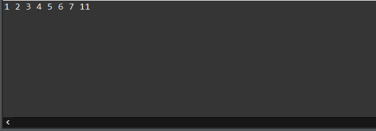

# Sort

> 2개 이상의 자료를 특정 기준에 의해 작은 값부터 큰 값(오름차순), 혹은 반대의 순서대로(내림차순) 재배열 하는 것


* Sort 종류
  * Bubble Sort(버블 정렬)
  * Counting Sort(카운팅 정렬)
  * Selection Sort(선택 정렬)
  * Quick Sort(퀵 정렬)
  * Insertion Sort(삽입 정렬)
  * Merge Sort(병합 정렬)


## Bubble Sort

> 인접한 두 개의 원소를 비교하며 자리를 계속 교환하는 방식

* 정렬 과정
  * 첫 번째 원소부터 인접한 원소끼리 계속 자리를 교환하면서 맨 마지막 자리까지 이동
  * 한 단계가 끝나면 가장 큰 원소 또는 가장 작은 원소가 마지막 자리로 정렬됨
* 교환하여 자리를 디오하는 모습이 ㅉ물 위에 올라오는 거품모양과 같다고 하여  Bubble Sort
* 시간 복잡도
  * O(n제곱)
* 예시
  * 55, 8, 78, 12, 42를 Bubble Sort 하는 과정
    1. 55, 7, 78, 12, 42
    2. 7, 55, 78, 12, 42
    3. 7, 55, 78, 12, 42
    4. 7, 55, 12, 78, 42
    5. 7, 55, 12, 42, 78
    6. 7, 55, 12, 42, 78
    7. 7, 12, 55, 42, 78
    8. 7, 12, 42, 55, 78
  * 가장 마지막 부분부터 정렬이 완료되고 나머지 범위에서 정렬을 반봅한다.


## Counting Sort

> 항목들의 순서를 결정하기 위해 집합에 각 항목이 몇 개씩 있는지 세는 작업을 하여, 선형 시간에 정렬하는 효율적인 Algorithm

* 제한 사항
  * 정수나 정수로 표현할 수 있는 자료에 대해서만 적용 가능
    * 각 항목의 발생 회수를 기록하기 위해, 정수 항목으로 인덱스되는 카운트들의 배열을 사용하기 때문
  * 카운트들을 위한 충분한 공간을 할당하려면 집합 내의 가장 큰 정수를 알아야 함.
* 시간 복잡도
  * O(n + k) - n은 항목의 개수, k는 정수의 최대 값
* 예시
  * 0, 4, 1, 3, 1, 2, 4, 1을 정렬하는 과정
    1. Data에서 각 항목들의 발생 횟수를 세고, 정수 항목들로 직접 인덱스 되는 카운트 배열 COUNTS에 저장
       - COUNTS = {1, 3, 1, 1, 2}
    2. 정렬된 집합에서 각 항목의 앞에 위치할 항목의 개수를 반영하기 위해 COUNTS의 원소를 조정
       - COUNTS = {1, 4, 5, 6, 8}
       - 해당 원소가 정렬될 때 배열의 몇 번째 위치에 들어가야 하는지를 보여줌
    3. COUNTS[1]을 감소시키고 TEMP에 1을 삽입
       - COUNTS[1]의 값이 4임을 확인하고 TEMP[4]에 1을 삽입하고 COUNTS[1]을 3으로 줄임
    4. 같은 방식으로 Data 배열을 전부 진행


## Selection Sort

> * Selection Sort 는 Bubble Sort와 유사한 알고리즘이다
> * **해당 순서에 원소를 넣을 위치는 이미 정해져 있고, 어떤 원소를 넣을지 선택하는 알고리즘이다**


* Code
  * 주어진 배열 중에서 최소값을 찾는다
  * 그 값을 맨 앞에 위치한 값과 교체한다
  * 맨 처음 위치를 뺀 나머지 배열을 같은 방법으로 교체한다

```java
package sort;

public class SelectionSort {

	public static void main(String[] args) {
		
		int[] numList={5,3,2,1,4,7,6,11};
		int swap;
		int minNum;
		
		for(int i=0; i<numList.length; i++) {
			minNum = i;
			for(int j=i+1; j<numList.length; j++) {
				if(numList[minNum] > numList[j]) {
					minNum = j;
				}
			}
			if(numList[i] > numList[minNum]) {
				swap = numList[i];
				numList[i] = numList[minNum];
				numList[minNum] = swap;
			}
			System.out.print(numList[i]+" ");
		}
	}
}
```

* 결과

 


* 시간복잡도
  * (n-1) + (n-2) + .... + 2 + 1 => n(n-1)/2
  * 비교하는 것이 상수 시간에 이루어진다는가정 아래, n개의 주어진 배열을 정렬하는데 **O(n^2)**만큼의 시간이 걸린다
* 공간복잡도
  * 주어진 배열 안에서 교환을 통해, 정렬이 수행되므로 **O(n)** 이다

* 장점
  * 알고리즘이 단순하다
  * 정렬을 위한 비교 횟수는 많지만, Bubble Sort에 비해 실제로 교환하는 횟수는 적기 때문에 ㅁ낳은 교환이 일어나야하는 자료상태에서 비교적 효율적이다.
  * Bubble Sort와 마찬가지로 정렬하고자 하는 배열 안에서 교환하는 방식이므로, 다른 메모리 공간을 필요로 하지 않는다
* 단점
  * 시간 복잡도가 비효율적
  * **불안정 정렬(Unstable Sort)**이다.


## Quick Sort

* 불안정 정렬

* 비교정렬

  * 다른 원소와의 비교만으로 정렬 수행

* 분할 정복 알고리즘의 하나로, 평균적으로 매우 빠른 수행 속도로 정렬 한다

  * merge sort와 달리 quick sort는 리스트를 비균등하게 분할 한다.

* 분할정복 방법

  * 문제를 작은 2개의 문제로 분리하고 각각을 해겨한 다음, 결과를 모아서 원래의 문제를 해걸
  * 분할 정복 방법은 순환 호출을 이용하여 구현한다.

* 과정

  1. 리스트 안에 있는 한 요소를 선택한다 = pivot
  2. pivot을 기준으로 pivot보다 작은 요소들을 모두 피벗의 왼졲으로 옮겨지고 피벗보다 큰 요소들은 피버스이 오른쪽으로 옮겨진다
  3. 피벗을 제외한 왼쪽 리스트와 오른쪽 리스트를 다시 정렬
     * 분할된 부분 리스트에 대하여 순환 호출을 이용하여 정렬을 반복
     * 부분 리스트에서더 다시 피벗을 정하고 피벗을 기준으로 작은수와 큰수로 나눈다
  4. 부분 리스트들이 더이상 분할이 불가능할 떄까지 반복한다
     * 리스트의 크기가 0이나 1이 될떄까지 반복


* 퀵정렬 단계
  * 분할(Divide) - 입력 배열을 피벗을 기준으로 비균등하게 2개의 부분 배열로 분할
    * 피벗을 중심으로 왼쪽은 작은 수 오른쪽은 큰 수의 리스트
  * 정복(Conquer) - 부분 배열을 정렬한다, 
    * 부분 배열의 크기가 충분히 작지 않으면 **순환 호출** 을 이용하여 다시 분할 정복 적용
  * 결합(Combine) - 정렬된 부분 배열들을 하나의 배열에 합병
    * 순환호출이 한번 진행될 떄마다 최소한 하나의 피벗은 최종적으로 위치가 정해지므로, 이 알고리즘은 반드시 끝난다는 것을 보장할 수 있다.


* 장점
  * 속도가 빠르다
    * 시간 복잡도가 O(nlog2n)을가지는 다른 정렬 알고리즘과 비교했을 때도 가장 빠르다
  * 추가 메모리 공간을 필요로 하지 않는다
    * 퀵정렬은 O(log n)만큼의 메모리를 필요로 한다
* 단점
  * 정렬된 리스트에 대해서는 퀵 정렬의 불균형 분할에 의해 오히려 수행시간이 더 많이 걸린다.

* 시간 복잡도