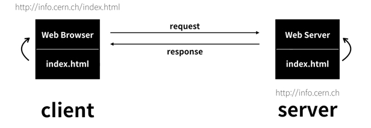
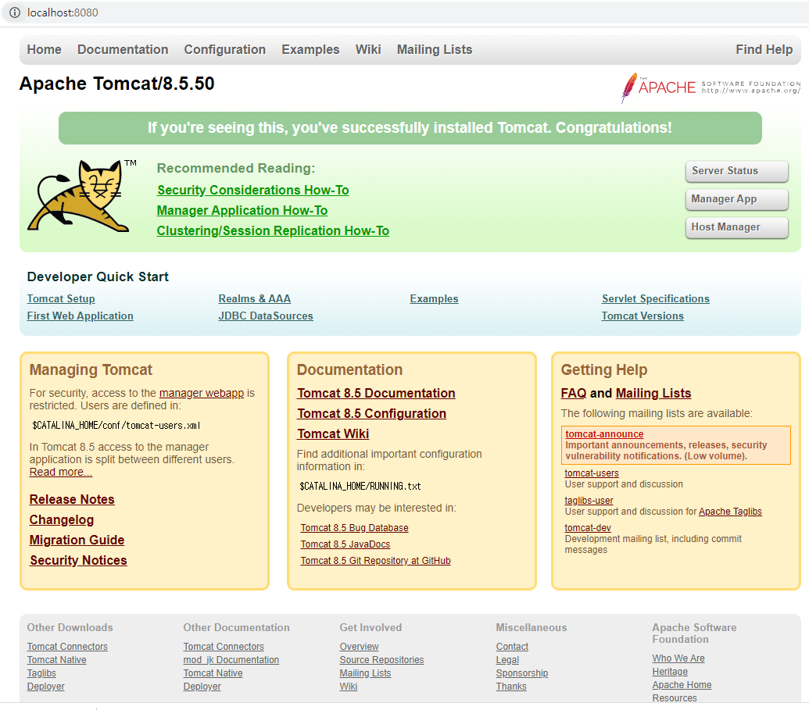
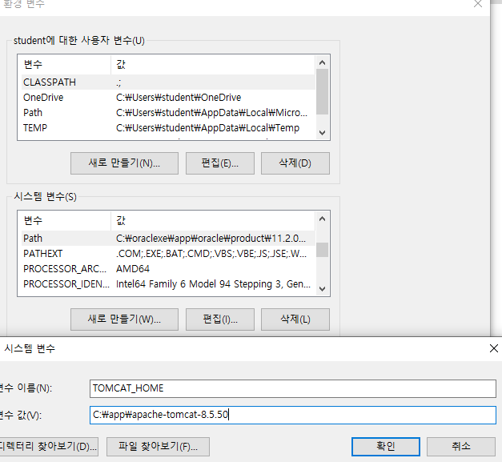
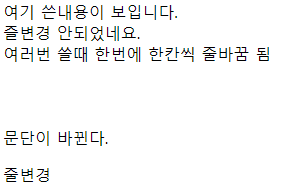

# Web 

> HTMLS
>
> CSS
>
> JavaScript
>
> jQuery



* Client

  요청

  html,css,JavaScript.....

  Client Side Script (해석이 client에 있는)

  * 문서구조 - HTML

    정적태그, 단항태그

  * 디자인 - CSS

  * 기능동작 - JavaScript

* Server

  응답

  Database,Framework,Java,python.....

  Server Side Script (해석이 server에 있는) - 코드 연산을 하고 client 에 응답을 해주기때문에 보안에 강하다.(client에서 코드 확인 불가)

  * jsp - tomcat
  * aspx - IIS
  * php - apache

# HTML

# Eclipse Web

## Tomcat

[	Apache Tomcat](http://tomcat.apache.org/) -> Download ->Tomcat8

* Tomcat 환경설정

```bash
## Tomcat과 eclipse port가 8080이 충돌이나서 eclipse port 변경

select dbms_xdb.gethttpport()from dual;  # port 확인

exec dbms_xdb.sethttpport(9090); # 기존 port를 9090으로 변경
```




## jar 파일 Java 폴더 복사


해당 경로로 복사 붙여넣기(el-api, jsp-api, servlet-api)

  C:\app\apache-tomcat-8.5.50\lib  ->  C:\Program Files\Java\jre1.8.0_231\lib\ext

## 

## Eclipse web setting

### Perspective

- Eclipse창의 우측 위의 `Open Perspective`를 사용하거나 `Windows` - `Perspective` - `Open Perspective`를 클릭하여 `Web`을 선택한다. 안보인다면 `Other`에서 탐색하면 된다.

### Dynamic Web Project

- Dynamic Web Project를 생성한다.
- 이 때, Dynamic Web module Version을 3.1로 조정한다. Java 8버전에 맞도록 설정하는 것이다.
- Next를 두번 눌러서 마지막 설정 페이지에서 Generate web.xml Deployment Descript를 체크한다.
  - JSP, Spring등에서는 설정파일로 `.XML`파일을 사용한다.

### Tomcat

- [Tomcat Site](https://tomcat.apache.org/)에서 Tomcat 8버전을 다운로드 받는다.

  - 8.5.50버전을 다운로드 받는다. 원하는 형태로 다운로드 받아도 되나, 압축형 파일이 문제가 생겼을 때 폴더를 삭제하고 새로 압축을 푸는 형태로 쉽게 다시 받을 수 있어서 압축형 파일로 다운로드 받았다.

- 압축파일을 해제하면 나오는 폴더를 살펴본다

  - `\bin\startup.bat`파일이 서버 시작파일이다.

  - `\conf\server.xml`파일이 서버 설정파일이다.

  - `\webapps\ROOT\index.jsp`파일이 `localhost:8080`으로 진입시 나오는 웹페이지이다.

    - 이 때 사용자이름과 비밀번호를 입력하는 창이 뜨거나 Tomcat창이 아닌 다른창이 뜬다면 문제가 있는 것이다. `8080`으로 설정된 `TOMCAT Port`가 이미 사용중이란 소리인데, `Oracle DB`를 사용중이고, `Port`를 건든적이 없다면 해당 `Oracle DB`의 `Port`가 `8080`일 것이다.

      - `Oracle DB`의 `Port`를 확인하고자 하면 관리자 계정으로 로그인하여 다음 쿼리문을 실행한다.

        ```
        SELECT dbms_xdb.gethttpport() from dual;
        ```

      - `Oracle DB`의 `Port`를 `9090`으로 변경해준다.

        ```
        EXEC dbms_xdb.sethttpport(9090);
        ```

  - 환경변수 설정

    

### Content Type

-   `Windows` - `Preferences` - `Content Type`의 다음 항목들의 `Default Encoding`을 `UTF-8`로 변경한 후 `Update`한다

  - ```
    CSS`, `HTML`, `Java Properties file`, `Java Source file`, `Javascript Source file`, `JSP
    ```

## ServerTest

- 생성한 후 `EUC-KR`을 전부 `UTF-8`로 변경해준다.

- `<%@ page %>`는 JSP시작태그이다.

  - TOMCAT의 lib폴더의 `el-api.jar`, `jsp-api.jar`, `servlet-api.jar`를 JAVA의 jre폴더의 ext폴더로 복사하여 붙여넣는다.

- `HTML`을 실행하여 웹페이지를 살펴보는 것은 `java`코드 실행과 동일하게 `Ctrl + F11`로 진행한다.

  - Tomcat을 Server로 지정하고 구동하면 Eclipse내부에 웹페이지가 표시된다
  - Eclipse 내부 웹페이지를 사용하지 않고 Chrome을 사용하기 위하여 `Windows` - `Web Browser` - `Chrome`을 선택해두고 다시 실행하면 된다.

- `HTML`파일 내부에 `JAVA Code`를 작성하고 싶다면 `<% %>`내부에 작성하면 된다.

  - Tomcat에서 해석되서 내용만 `HTML`파일로 나가기 때문에, 웹페이지에서 소스를 살펴보면 코드가 보이는 것이 아니라 코드의 완성내용만 보인다.
  - Server Side Script

  ```bash
  <%@ page language="java" contentType="text/html; charset=UTF-8"
      pageEncoding="UTF-8"%>
      
  <%@ page import = "java.util.*" %>
  
  <!DOCTYPE html>
  <html>
  <head>
  <meta charset="UTF-8">
  <title>Insert title here</title>
  </head>
  <body>
  <h1>Server Test 입니다.</h1>
  <% Date today = new Date(); %>  #
  <%= today %>                    #
  </body>
  </html>
  ```

  

  - 

# HTML TAG

```bash
<!DOCTYPE html>
<html>
<head>
<meta charset="EUC-KR">
<title>처음 만든 웹페이지</title>
</head>
<body>
여기 쓴내용이 보입니다.<br/>
즐변경 안되었네요.<br>
여러번 쓸때 한번에 한칸씩 줄바꿈 됨<br><br><br><br>
문단이 바뀐다.<p>
줄변경
</body>
</html>
```




## HTML TEMPLATE 생성/변경/적용


##  Image

### 상대경로

```bash
<!DOCTYPE html>  <!-- html5 dtd type -->
<!-- <!DOCTYPE HTML PUBLIC "-//W3C//DTD HTML 4.01//EN"
            "http://www.w3.org/TR/html4/strict.dtd"> -->
<html>
<head>
<meta charset="UTF-8">
<title>image tag </title>
</head>
<body>
<!-- 상대경로 -->
<!--  -->

가나다라마바사아자차카파타하가나다라마바사아자차카파타하
가나다라마바사아자차카파타하

<!-- 절대경로 -->
</br><br><br>

</body>
</html>
```


### 절대경로


## <a tag

## <table tag

## &nbsp ;

> tap 역할

# CSS

## Usage

```bash
.accent{
		font-size:20px;
		color:red;
		font-weight: bold;
	}
```

- `@import`를 통하여 다른 파일의 `CSS`를 가져와서 적용시킬 수 있다.

- `.className` : 특정 태그에서 선언된 class에 대해서 선언할 때 이용한다.
  
  - `div`와 같은 태그를 생략할 수 있다.
  
- `#idName` : 특정 태그에서 선언된 id에 대해서 선언할 때 사용한다.
  
  - `.className ul li` : `className`라는 `class`를 가진 태그 내부에 있는 `ul`태그 내부의 `li`태그의 CSS를 지정해줄 때 사용한다.
  - 선택자 다중 지정
  
  
## 선택자 다중지정

  ```bash
  body, h1, p{
  	background-color: yellow;
  	}
  ```

  * 여러개의 태그에 대한 CSS를 한번에 설정할 수 있다.

## 우선순위

  > id > class > selector

  - id의 우선순위가 가장 높으며 선택자의 우선순위가 가장 낮다.

## In HTML

```
<head>
    <link rel="stylesheet" href="../../CSS/Test.css" type="text/css">
</head>
```

- `link`로 `CSS File`을 호출해서 가져온다.


## Parameter

> 지정할 수 있는 수많은 Parameter가 있지만 자주 쓰거나, 유의해야할 것 몇개만 짚어본다.

- `margin` : 여백을 만들어주는 인자

  ```
  margin: 100px 50px;
  ```

  - `top`, `right`, `bottom`, `left`순으로 선언되며 선언되지 않은 부분은 대칭된 부분의 값과 같다.

  - 하나의 값만 선언되면 모든 방향이 그 값으로 지정된다.

  - `px`단위는 생략될 수 있다. `px`가 아닌 `%`로 값을 지정할 수도 있다.

  - 혹은 `margin-bottom`처럼 각 방향을 언급한 `parameter`를 사용할 수 있다.

  - 맞붙은 두 태그의

     

    ```
    margin
    ```

    이 중첩될경우 두

     

    ```
    margin
    ```

    중 수치가 큰 것 하나만 적용된다.

    - 위 태그의 `margin-bottom`이 50이고 아래 태그의 `margin-top`이 100일 때 두 태그 사이의 `margin`은 150으로 적용되는 것이 아닌 큰 수치인 100으로 적용된다.

- `color`관련 인자에서 `rgba`

  - `(0, 0, 0, 0)`처럼 4개의 인자를 받는다. 앞의 세개는 r,g,b를 의미하며 0~~255까지의 값을 가진다. 맨뒤의 값은 투명도를 의미하며 0~~1까지의 값을 가진다.

# JavaScript

> 위치 상관 없다.
>
> jsp&servlet, javaScript에서는 tag와 쿼리문은 문자열 안에서 선언한다.

* javaScript와 HTML에서 출력 비교

```javascript
<!DOCTYPE html>
<html>
<head>
<meta charset="UTF-8">
<meta name="viewport" content="width=device-width, initial-scale=1.0" />
<meta http-equiv="X-UA-Compatible" content="ie=edge" />
<title>ex01_js.html JavaScript Test </title>

<script type="text/javascript">
	document.write("javaScript를 이용한 출력<br>");
	document.write("javaScript는 대보문자 구분한다<br>");
	document.writeln(" <font color='red' size='5'> javaScript를 이용한 출력</font>");
	
	function hello(){
		alert('안녕');  /* 우선 순위가 높다 (가장 상위에 출력)*/
	}
</script>

</head>
<body onload="hello()"> 

	<p>브라우저에서 출력되었습니다.</p>
	<input type="button" value="눌러봐" onclick=hello()>  
	

</body>
</html>
```

* document.write - 출력 method
* method 호출은 "hello()", hello() 둘다 사용 가능하다

### type

> 티입선을 을 하지않아도 된다, 단 var str= 선언시 초기화 값을 지정해 줘야한다(초기화 지정시에 타입이 자동 형성되기 때문에 -.>초기화 값 지정해주지 않으면 undefinde 가 뜬다)

# 유용 사이트

[w3schools](https://www.w3schools.com/)

[https://www.w3.org/](https://www.w3.org/)

[HTML5/CSS 특강](https://www.youtube.com/playlist?list=PLMfOC9Ny9UB_w3Ru8HI0g00bxz21LA0gL)

### 학습 사이트

[생활코딩](https://opentutorials.org/course/1)

[JAVA강좌 Youtube](https://www.youtube.com/playlist?list=PLieE0qnqO2kTyzAlsvxzoulHVISvO8zA9)

[Web개발 학습](https://developer.mozilla.org/ko/docs/Learn)

[프로그램 학습](https://www.javatpoint.com/android-tutorial)

[hg](https://github.com/TunaHG)